# Customize the Wizard Generated Application
<!-- description --> Customize a wizard-generated application and learn how to use Fiori object cells, search UI, and the collection view.

## Prerequisites
- You have [Set Up a BTP Account for Tutorials](group.btp-setup). Follow the instructions to get an account, and then to set up entitlements and service instances for the following BTP services.
    - **SAP Mobile Services**
- You completed [Try Out the SAP BTP SDK Wizard for Android](sdk-android-wizard-app).


## You will learn
- How to customize the values displayed in an object cell
- How to modify the navigation between screens
- How to change menu options
- How to enable filtering of object cells on a list screen
- How to add a collection view showing the top products

---

### Examine the products list screen


1.  Run the previously created project.

2.  Select **Products**.

    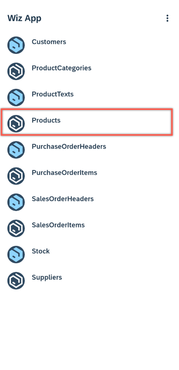

    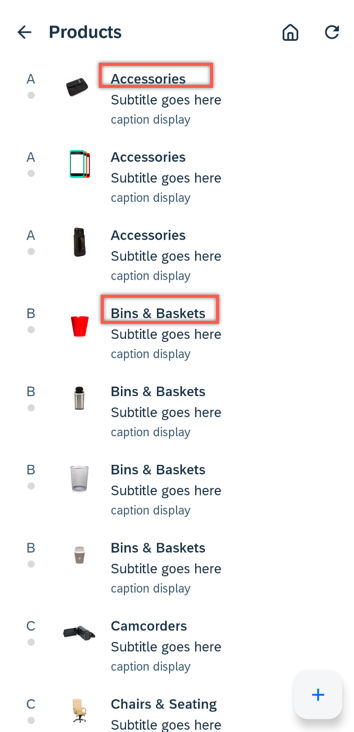

    The category name is displayed (rather than the product name) because the app was generated from the OData service's metadata, which does not specify which of the many fields from the product entity to display. When creating the sample user interface, the SDK wizard uses the first property found as the value to display. To view the complete metadata document, open the `res/raw/com_sap_edm_sampleservice_v4.xml` file.

    ```XML
    <EntityType Name="Product">
        <Key>
            <PropertyRef Name="ProductID"/>
        </Key>
        <Property Name="Category" Type="Edm.String" Nullable="true" MaxLength="40"/>
        ... ...
        <Property Name="Name" Type="Edm.String" Nullable="false" MaxLength="80"/>
        ... ...
    </EntityType>
    ```

    Each product is displayed in an [object cell](https://help.sap.com/doc/f53c64b93e5140918d676b927a3cd65b/Cloud/en-US/docs-en/guides/features/fiori-ui/android/object-cell.html), which is one of the Fiori UI controls for Android.

    

    As seen above, an object cell is used to display information about an entity.


### Update the products list screen


In this section, you will configure the object cell to display a product's name, category, description, and price.

[OPTION BEGIN [Jetpack Compose-based UI]]

1.  In Android Studio, on Windows, press **`Ctrl+shift+N`**, or on a Mac, press **`command+shift+O`**. Type **`ProductEntitiesScreen`** to open `ProductEntitiesScreen.kt`.

2.  On Windows, press **`Ctrl+F`**, or on a Mac, press **`command+F`**, and type **`viewModel.getEntityTitle(entity)`** to navigate to the line `setHeadline(viewModel.getEntityTitle(entity))`. Change this line to `setHeadline(entity.getOptionalValue(Product.name).toString())`. This will display the product name as the headline value of the object cell.

    If the class `Product` appears in red, it indicates that Android Studio could not locate the class. Select the class, and on Windows press **`Alt+Enter`**, or on a Mac, press **`option+return`** to use Android Studio's quick fix to add the missing imports.

    Alternatively, you can open the settings screen: Windows: **Settings**; Mac: **Android Studio > Settings...**. Then go to **Editor > General > Auto Import**, enable **Add unambiguous imports on the fly** in the `Kotlin` section.

3.  In the same code block, replace `setSubheadline` and `setFootnote`, and add `setStatusInfoLabel` with the following code, which will display the category, description, and price.

    ```Kotlin
    setSubheadline(entity.getDataValue(Product.category).toString())
    setFootnote(entity.getDataValue(Product.shortDescription).toString())
    setStatusInfoLabel(
        FioriStatusInfoLabelDataInOC(
            items = listOf(
                FioriLabelItemData(
                    label = "$ ${entity.getDataValue(Product.price).toString()}"
                )
            )
        )
    )
    ```

4.  On Windows, press **`Ctrl+F`**, or on a Mac, press **`command+F`**, and type **`FioriObjectCell`** to navigate to the `FioriObjectCell` invocation.

5.  Add the following code right after `FioriObjectCell` invocation, and add it right before `if (entities.loadState.refresh == LoadState.Loading)` at the same time, to add a divider between the product items.

    ```Kotlin
    FioriDivider()
    ```

6.  On Windows, press **`Ctrl+N`**, or on a Mac, press **`command+O`**, and type **`Repository`** to open `Repository.kt`.

7.  On Windows, press **`Ctrl+F12`**, or on a Mac, press **`command+F12`**, and type **`read`** to navigate to the `read(pageSize: Int = 40, page: Int = 0)` method.

8.  Replace the `orderByProperty?.also` block with the following code to specify that the sort order should be by category and then by the name of the products.

    ```Kotlin
    orderByProperty?.also {
        dataQuery.orderBy(it, SortOrder.ASCENDING)
        if (entitySet.entityType == ESPMContainerMetadata.EntityTypes.product) {
            dataQuery.thenBy(Product.name, SortOrder.ASCENDING)
        }
    }
    ```

9.  Quit the app and then re-run it. You'll see that the **Products** screen has been updated to display the product's name, category, description, and price, with the entries sorted by category and then by name.

    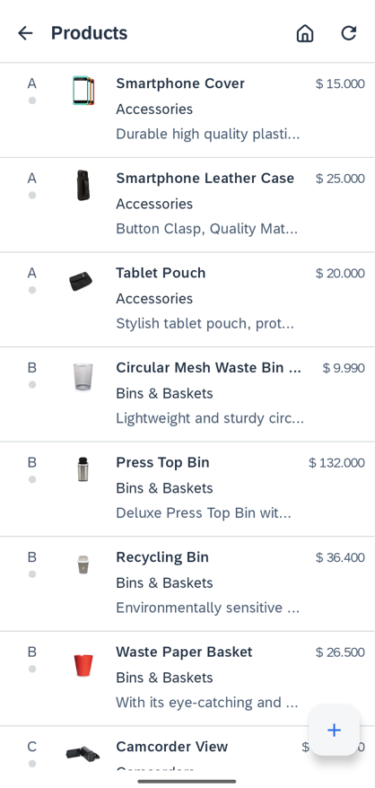

[OPTION END]

[OPTION BEGIN [View-based UI]]

1.  In Android Studio, on Windows, press **`Ctrl+N`**, or on a Mac, press **`command+O`**. Type **`ProductsListFragment`** to open `ProductsListFragment.kt`.

2.  On Windows, press **`Ctrl+F12`**, or on a Mac, press **`command+F12`**, and type **`populateObjectCell`** to navigate to the `populateObjectCell` method. Change the parameter in the first line of the method from **`getOptionalValue(Product.category)`** to **`getOptionalValue(Product.name)`**. This will ensure that the product name is displayed as the headline value of the object cell:

    ```Kotlin
    val dataValue = productEntity.getOptionalValue(Product.name)
    ```

3.  Replace the `viewHolder.objectCell.apply` block with the following code, which will display the category, description, and price.

    ```Kotlin
    viewHolder.objectCell.apply {
      headline = masterPropertyValue
      setUseCutOut(false)

      (productEntity.getDataValue(Product.category))?.let {
        subheadline = it.toString()
      }

      (productEntity.getDataValue(Product.shortDescription))?.let {
        footnote = it.toString()
      }

      (productEntity.getDataValue(Product.price))?.let {
        statusWidth = 200
        setStatus("$ $it", 1)
      }
    }
    ```

4.  On Windows, press **`Ctrl+F12`**, or on a Mac, press **`command+F12`**, and type **`onViewStateRestored`** to navigate to the `onViewStateRestored` method.

5.  Replace `fragmentBinding.itemList?.let` block with the following code, which adds a divider between product items.

    ```Kotlin
    fragmentBinding.itemList.let {
        val linearLayoutManager = LinearLayoutManager(currentActivity)
        val dividerItemDecoration =
            DividerItemDecoration(it.context, linearLayoutManager.orientation)
        it.addItemDecoration(dividerItemDecoration)
        it.layoutManager = linearLayoutManager
        this.adapter = ProductListAdapter(currentActivity, it)
        it.adapter = this.adapter
    }
    ```

    If the classes `LinearLayoutManager` and `DividerItemDecoration` appear in red, it indicates that Android Studio could not locate them. Select each class, and on Windows, press **`Alt+Enter`**, or on a Mac, press **`option+return`** to use Android Studio's quick fix to add the missing imports.

    Alternatively, you can enable the following setting: Windows: **Settings**; Mac: **Android Studio > Settings...**. Then go to **Editor > General > Auto Import**, enable **Add unambiguous imports on the fly** in the `Kotlin` section.

6.  On Windows, press **`Ctrl+N`**, or on a Mac, press **`command+O`**, and type **`Repository`** to open `Repository.kt`.

7.  On Windows, press **`Ctrl+F12`**, or on a Mac, press **`command+F12`**, and type **`read`** to move to the `read()` method.

8.  Replace the `if (!entitySet.isSingleton && orderByProperty != null)` block with the following code to specify that the sort order should be by category and then by the name of the products.

    ```Kotlin
    if (!entitySet.isSingleton && orderByProperty != null) {
        dataQuery = dataQuery.orderBy(orderByProperty, SortOrder.ASCENDING)
        if (entitySet.entityType == ESPMContainerMetadata.EntityTypes.product) {
            dataQuery.thenBy(Product.name, SortOrder.ASCENDING)
        }
    }
    ```

9.  Quit the app and then re-run it. You'll see that the **Products** screen has been updated to display the product's name, category, description, and price, with the entries sorted by category and then by name.

    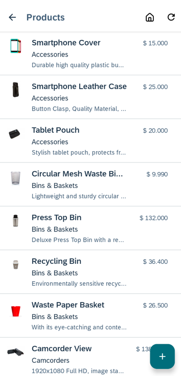

[OPTION END]


### Customize the `ProductCategories` screen

[OPTION BEGIN [Jetpack Compose-based UI]]

Examine the **`ProductCategories`** screen.

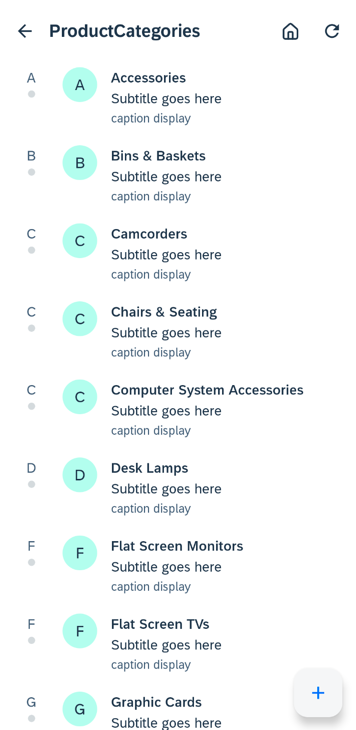

In this section, you will update the screen's title, configure the object cell to display the category name and main category name, add the number of products in each category, and include a separator decoration between cells.

1.  Press **`Shift`** twice and type **`strings.xml`** to open `res/values/strings.xml`.

2.  Add the following entry:

    ```XML
    <string name="product_categories_title">Product Categories</string>
    ```

3.  On Windows, press **`Ctrl+Shift+N`**, or on a Mac, press **`command+shift+O`**, and type **`ProductCategoryEntitiesScreen`**, to open `ProductCategoryEntitiesScreen.kt`.

4.  On Windows, press **`Ctrl+F`**, or on a Mac, press **`command+F`**, and type **`title`** to move to the `title` line.

5.  On Windows, press **`Ctrl+/`**, or on a Mac, press **`command+/`**, to comment out the line.

6.  Add the following line right after the commented-out line to set the screen's title:

    ```Kotlin
    title = stringResource(id = R.string.product_categories_title),
    ```

7.  On Windows, press **`Ctrl+F`**, or on a Mac, press **`command+F`**, and type **`FioriObjectCell`** to navigate to the `FioriObjectCell` invocation. 

8.  Add the following code right after `FioriObjectCell` invocation and add it right before `if (entities.loadState.refresh == LoadState.Loading)` at the same time, which adds a divider between categories:

    ```Kotlin
    FioriDivider()
    ```

9.  On Windows, press **`Ctrl+F`**, or on a Mac, press **`command+F`**, and type **`FioriObjectCellData`**, to move to the `FioriObjectCellData` code block.

10. Replace the value of `objectCellData` with the following to display the main category instead, hide the footnote, and show the number of products per category.

    ```Kotlin
    val objectCellData = FioriObjectCellData.Builder().apply {
        setHeadline(viewModel.getEntityTitle(entity))
        setSubheadline(entity.getDataValue(ProductCategory.mainCategoryName).toString())
        setAvatar(avatar)
        setStatusInfoLabel(
            FioriStatusInfoLabelDataInOC(
                items = listOf(
                    FioriLabelItemData(
                        label = "${entity.getDataValue(ProductCategory.numberOfProducts).toString()} Products"
                    )
                )
            )
        )
    }.build()
    ```

11. Run the app again. You'll see that the **title**, **subheadline**, and **status** are now displayed, while the **icon** and **footnote** are no longer visible.

    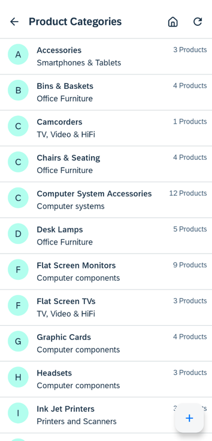

[OPTION END]

[OPTION BEGIN [View-based UI]]

Examine the **`ProductCategories`** screen.

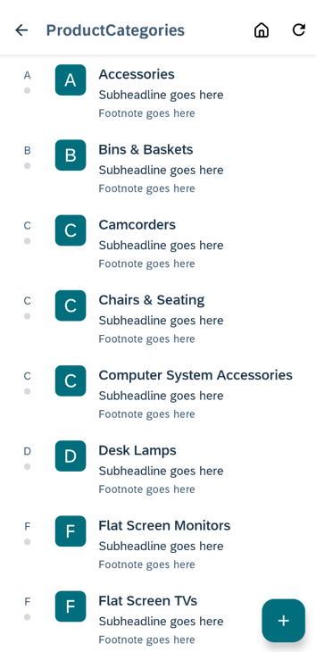

In this section, you will update the screen's title, configure the object cell to display the category name and main category name, add the number of products in each category, and include a separator decoration between cells.

1.  Press **`Shift`** twice and type **`strings.xml`** to open `res/values/strings.xml`.

2.  Add the following entry:

    ```XML
    <string name="product_categories_title">Product Categories</string>
    ```

3.  On Windows, press **`Ctrl+N`**, or on a Mac, press **`command+O`**, and type **`ProductCategoriesListFragment`**, to open `ProductCategoriesListFragment.kt`.

4.  On Windows, press **`Ctrl+F12`**, or on a Mac, press **`command+F12`**, and type **`onViewStateRestored`** to move to the `onViewStateRestored` method, find the `currentActivity.title = activityTitle` line.

5.  On Windows, press **`Ctrl+/`**, or on a Mac, press **`command+/`**, to comment out the line.

6.  Add the following line right after the commented-out line to set the screen's title:

    ```Kotlin
    currentActivity.title = resources.getString(R.string.product_categories_title)
    ```

7.  Still in this method, replace the `fragmentBinding.itemList?.let` block with the following code, which adds a divider between categories:

    ```Kotlin
    fragmentBinding.itemList.let {
        val linearLayoutManager = LinearLayoutManager(currentActivity)
        val dividerItemDecoration =
            DividerItemDecoration(it.context, linearLayoutManager.orientation)
        it.addItemDecoration(dividerItemDecoration)
        it.layoutManager = linearLayoutManager
        this.adapter = ProductCategoryListAdapter(currentActivity, it)
        it.adapter = this.adapter
    }
    ```

8.  On Windows, press **`Ctrl+F12`**, or on a Mac, press **`command+F12`**, and type **`populateObjectCell`**, to move to the `populateObjectCell` method.

9.  Replace the `viewHolder.objectCell.apply` block with the following to display the main category instead, hide the footnote, and show the number of products per category.

    ```Kotlin
    viewHolder.objectCell.apply {
      headline = masterPropertyValue
      detailImage = null
      setDetailImage(viewHolder, productCategoryEntity)

      (productCategoryEntity.getDataValue(ProductCategory.mainCategoryName))?.let {
        subheadline = it.toString()
      }

      lines = 2  //Not using footnote

      (productCategoryEntity.getDataValue(ProductCategory.numberOfProducts))?.let {
        statusWidth = 220
        setStatus("$it Products", 1)
      }
    }
    ```

10. Run the app again. You'll see that the **title**, **subheadline**, and **status** are now displayed, while the **icon** and **footnote** are no longer visible.

    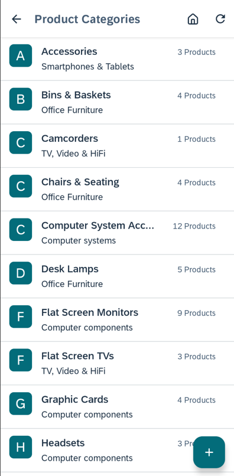

[OPTION END]


### Customize the navigation


In this section, you will modify the app to initially show the **Product Categories** screen when opened. Selecting a category will navigate to a **Products** screen for the selected category. The floating action button on the **Categories** screen will be removed.

[OPTION BEGIN [Jetpack Compose-based UI]]

1. On Windows, press **`Ctrl+Shift+N`**, or on a Mac, press **`command+Shift+O`**, and type **`ODataNavHost`**, to open `ODataNavHost.kt`.

2. Change the `startDestination` of `NavHost` to:

    ```Kotlin
    EntityNavigationCommands(ESPMContainerMetadata.EntityTypes.productCategory).entityListNav.route
    ```

    Add the following composable content before `composable(route = EntitySetsDest.route)` code block:

    ```Kotlin
    composable(route = EntityNavigationCommands(ESPMContainerMetadata.EntityTypes.productCategory).entityListNav.route) {
        val viewModel: ODataViewModel = viewModel(
            factory = ODataEntityViewModelFactory(
                LocalContext.current.applicationContext as Application,
                ESPMContainerMetadata.EntityTypes.productCategory,
                ESPMContainerMetadata.EntitySets.productCategories,
                getOrderByProperty(ESPMContainerMetadata.EntityTypes.productCategory),
            )
        )

        ODataScreen(
            navController,
            isExpandedScreen,
            viewModel,
            ProductCategoryEntitiesExpandScreen,
            ProductCategoryEntitiesScreen,
            ProductCategoryEntityEditScreen,
            ProductCategoryEntityDetailScreen
        )
    }
    ```

    This will cause the **Product Categories** screen to be the first screen seen when opening the app. 

3. On Windows, press **`Ctrl+N`**, or on a Mac, press **`command+O`**, and type **`ODataViewModel`**, to open `ODataViewModel.kt`.

4. On Windows, press **`Ctrl+F12`**, or on a Mac, press **`command+F12`**, and type **`onFloatingAdd`**, to navigate to `onFloatingAdd` method.

5. Replace the `onFloatingAdd` function with the following code:

    ```Kotlin
    //return create action when nav property value is list type or null, or entitySet is singleton and entity screen is not empty
    fun onFloatingAdd(): (() -> Unit)? {
        val action = this::onCreateAction
        // If a singleton entity already exists on the screen, remove the "+" floating button.
        entitySet?.let {
            if (it.isSingleton && _odataUIState.value.masterEntity != null) {
                return null
            }
        }

        return parent?.let { parent ->
            return navigationPropertyName?.let {
                val navProp = parent.entityType.getProperty(navigationPropertyName)
                val navValue = parent.getOptionalValue(navProp)
                if(navProp.isEntityList || navValue == null ) action else null
            } ?: action
        } ?: action
    }
    ```

6. On Windows, press **`Ctrl+Shift+N`**, or on a Mac, press **`command+Shift+O`**, and type **`ProductEntitiesScreen`**, to open `ProductEntitiesScreen.kt`.

7. Add a variable in the method body to retrive the selected category name from `ODataViewModel`:

    ```Kotlin
    val category = (viewModel.parent as? ProductCategory)?.categoryName
    ```

8. On Windows, press **`Ctrl+F`**, or on a Mac, press **`command+F`**, and type **`return@items`** to locate the line `val entity = entities[index] ?: return@items`. Immediately after this line, add the following code to filter the products list to display only the products for the selected category:

    ```Kotlin
    category?.also {
        if((entity as Product).category != it) {
            return@items
        }
    }
    ```

9. On Windows, press **`Ctrl+Shift+N`**, or on a Mac, press **`command+Shift+O`**, and type **`ODataNavHost`**, to open `ODataNavHost.kt`.

10. Replace the `if (!uiState.isEntityFocused)` block with the following:
    
    ```Kotlin
    if (!uiState.isEntityFocused) {
        entityListScreen(
            {
                if (viewModel.entityType != ESPMContainerMetadata.EntityTypes.productCategory) {
                    navController.navigate(EntitySetsDest.route)
                }
            },
            {
                if (viewModel.entityType == ESPMContainerMetadata.EntityTypes.productCategory) {
                    navController.navigate(EntitySetsDest.route)
                } else {
                    navController.navigateUp()
                }
            },
            viewModel,
            false
        )
    }
    ```

    You can navigate to the **EntityList** screen by pressing the **Back** button on the **Product Categories** screen. The **EntityList** screen retains the **Settings** menu for convenience.

11. Replace the `EntityOperationType.DETAIL` code block with the following, which will enable the navigation from the Category list screen to the Product list screen.

    ```Kotlin
    EntityOperationType.DETAIL -> if (viewModel.entityType == ESPMContainerMetadata.EntityTypes.productCategory) {
        viewModel.lostEntityFocus()
        val productCategory = uiState.masterEntity as ProductCategory
        navController.currentBackStackEntry?.savedStateHandle?.set(
            key = "productCategory", value = productCategory
        )
        navController.navigate(EntityNavigationCommands(ESPMContainerMetadata.EntityTypes.product).entityListNav.route)
    } else {
        entityDetailScreen(
            onNavigateProperty,
            viewModel::lostEntityFocus,
            viewModel,
            false
        )
    }
    ```

12. Replace the `viewModel` of `composable(route = EntityNavigationCommands(entityType).entityListNav.route)` with the following `viewModel` so that the product screen can retrieve the selected category name:

    ```Kotlin
    val viewModel: ODataViewModel = viewModel(
        factory = ODataEntityViewModelFactory(
            LocalContext.current.applicationContext as Application,
            entityType,
            entitySet,
            getOrderByProperty(entityType),
            if (entityType == ESPMContainerMetadata.EntityTypes.product)
                navController.previousBackStackEntry?.savedStateHandle?.get<ProductCategory>(
                    "productCategory"
                )
            else null
        )
    )
    ```

13. On Windows, press **`Ctrl+Shift+N`**, or on a Mac, press **`command+Shift+O`**, and type **`ProductCategoryEntitiesScreen`**, to open `ProductCategoryEntitiesScreen.kt`.

14. Set `floatingActionClick` in `OperationScreenSettings` of `OperationScreen` to **`null`** instead of `viewModel.onFloatingAdd()`.

15. On Windows, press **`Ctrl+Shift+N`**, or on a Mac, press **`command+Shift+O`**, and type **`EntityScreenCommonUI`**, to open `EntityScreenCommonUI.kt`.

16. Find the `ActionItem` of `R.string.menu_home` and change its overflowMode to the following:

    ```Kotlin
    overflowMode = if(viewModel.entityType == ESPMContainerMetadata.EntityTypes.productCategory) OverflowMode.NOT_SHOWN else OverflowMode.IF_NECESSARY,
    ```

17. Run the app again. You'll see that the **Product Categories** screen is now the first screen displayed, the **Home** menu is no longer visible, and selecting a category shows the products list screen, which now displays only the products for that selected category.

    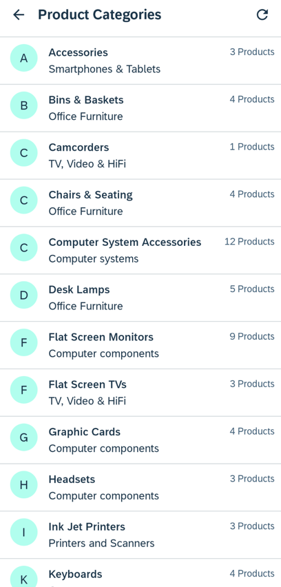

[OPTION END]

[OPTION BEGIN [View-based UI]]

1. On Windows, press **`Ctrl+N`**, or on a Mac, press **`command+O`**, and type **`MainBusinessActivity`**, to open `MainBusinessActivity.kt`.

2. On Windows, press **`Ctrl+F12`**, or on a Mac, press **`command+F12`**, and type **`startEntitySetListActivity`**, to move to the `startEntitySetListActivity` method.

3. Add the following line below the other Intent declaration:

    ```Kotlin
    val pcIntent = Intent(this, ProductCategoriesActivity::class.java)
    ```

4. After the call to `startActivity(intent)`, add the following line:

    ```Kotlin
    startActivity(pcIntent)
    ```

    This will cause the **Product Categories** screen to be the first screen seen when opening the app, but because the **EntityList** screen is opened first, it can be navigated to by pressing the **Back** button. The **EntityList** screen retains the **Settings** menu for convenience.

5. On Windows, press **`Ctrl+N`**, or on a Mac, press **`command+O`**, and type **`ProductCategoriesListFragment`**, to open `ProductCategoriesListFragment.kt`.

6. On Windows, press **`Ctrl+F12`**, or on a Mac, press **`command+F12`**, and type **`prepareViewModel`** to move to the `prepareViewModel` method.

7. Replace the `fragmentBinding.fab?.let` block with the following code:

    ```Kotlin
    fragmentBinding.fab?.let {createButton ->
        parentEntityData?.let {parent ->
            navigationPropertyName?.let {
                if (!isNavigationPropertyConnection && entityList.isNotEmpty()){
                    createButton.hide()
                } else {
                    createButton.show()
                }
            }
        }
    }
    ```

8. Add the `onCreateMenu` method into the class right after the `onCreateView` method.
   
    ```Kotlin
    override fun onCreateMenu(menu: Menu, menuInflater: MenuInflater) {
        super.onCreateMenu(menu, menuInflater)
        menu.removeItem(R.id.menu_home)
    }
    ```

9. On Windows, press **`Ctrl+F12`**, or on a Mac, press **`command+F12`**, and type **`setOnClickListener`**, to move to the `setOnClickListener` method.

10. Replace the code with the following, which will enable the navigation from the Category list screen to the Product list screen.

    ```Kotlin
    holder.itemView.setOnClickListener { view ->
        val productsIntent = Intent(currentActivity, ProductsActivity::class.java)
        productsIntent.putExtra("category", productCategoryEntity.categoryName)
        view.context.startActivity(productsIntent)
    }
    ```

11. On Windows, press **`Ctrl+N`**, or on a Mac, press **`command+O`**, and type **`ProductsListFragment`**, to open `ProductsListFragment.kt`.

12. On Windows, press **`Ctrl+F`**, or on a Mac, press **`command+F`**, and search for `listAdapter.setItems(entityList)`. Replace that line with the following code, which will filter the products list to display only the products for the selected category:

    ```Kotlin
    currentActivity.intent.getStringExtra("category")?.let { category ->
        val matchingProducts = arrayListOf<Product>()
        for (product in entityList) {
            product.category?.let {
                if (it == category) {
                  matchingProducts.add(product)
                }
            }
        }
        listAdapter.setItems(matchingProducts)
    } ?: listAdapter.setItems(entityList)
    ```

13. Run the app again. You'll see that the **Product Categories** screen is now the first screen displayed, the **Home** menu is no longer visible, and selecting a category shows the products list screen, which now displays only the products for that selected category.

    

[OPTION END]


### Add category filtering


In this section you will add a search field to **Product Categories** screen, allowing users to filter the results displayed on the screen.

[OPTION BEGIN [Jetpack Compose-based UI]]

1.  First, right-click the `res/drawable` folder to create a new **Drawable Resource File** **`ic_search_icon.xml`**, and use the following XML content.

    ```XML
    <?xml version="1.0" encoding="utf-8"?>
    <vector xmlns:android="http://schemas.android.com/apk/res/android"
        android:width="24dp"
        android:height="24dp"
        android:viewportWidth="24"
        android:viewportHeight="24">
        <path
            android:fillColor="#000"
            android:pathData="M15.5,14h-0.79l-0.28,-0.27C15.41,12.59 16,11.11 16,9.5 16,5.91 13.09,3 9.5,3S3,5.91 3,9.5 5.91,16 9.5,16c1.61,0 3.09,-0.59 4.23,-1.57l0.27,0.28v0.79l5,4.99L20.49,19l-4.99,-5zM9.5,14C7.01,14 5,11.99 5,9.5S7.01,5 9.5,5 14,7.01 14,9.5 11.99,14 9.5,14z"/>
    </vector>
    ```

    We will now use the new XML file for the **Product Categories** screen.

2.  On Windows, press **`Ctrl+Shift+N`**, or on a Mac, press **`command+Shift+O`**, and type **`strings_localized`**, to open the `strings_localized.xml` file.

3.  Add the following content:
    
    ```XML
    <!-- XMIT: Search menu item -->
    <string name="menu_search">Search</string>
    ```

4.  On Windows, press **`Ctrl+Shift+N`**, or on a Mac, press **`command+Shift+O`**, and type **`EntityScreenCommonUI`**, to open the `EntityScreenCommonUI.kt` file.

5.  Add the following `ActionItem` right before the other `ActionItem`s in the function `getSelectedItemActionsList(navigateToHome: () -> Unit, viewModel: ODataViewModel, deleteState: MutableState<Boolean>)`. (Note that there is another function with the same name that takes two parameters.)

    ```Kotlin
    ActionItem(
        nameRes = R.string.menu_search,
        iconRes = if (viewModel.showSearchInput.collectAsState().value) R.drawable.ic_sap_icon_decline else R.drawable.ic_search_icon,
        overflowMode = if(viewModel.entityType == ESPMContainerMetadata.EntityTypes.productCategory) OverflowMode.IF_NECESSARY else OverflowMode.NOT_SHOWN,
        doAction = if (viewModel.showSearchInput.collectAsState().value) viewModel::hideSearchInput else viewModel::showSearchInput
    ),
    ```

6.  On Windows, press **`Ctrl+N`**, or on a Mac, press **`command+O`**, and type **`BaseOperationViewModel`**, to open the `BaseOperationViewModel` class.

7.  Add the following to the bottom of the class:

    ```Kotlin
    private val _showSearchInput = MutableStateFlow(false)
    val showSearchInput: StateFlow<Boolean> = _showSearchInput
    private val _searchQuery = MutableStateFlow("")
    val searchQuery: StateFlow<String> = _searchQuery

    fun showSearchInput() {
        _showSearchInput.value = true
    }

    fun hideSearchInput() {
        _showSearchInput.value = false
    }

    fun onSearchQueryChanged(newText: String) {
        // Handle query text change
        _searchQuery.value = newText
    }
    ```

8.  On Windows, press **`Ctrl+Shift+N`**, or on a Mac, press **`command+Shift+O`**, and type **`BaseOperationScreen`**, to open the `BaseOperationScreen.kt` file.

9.  On Windows, press **`Ctrl+F12`**, or on a Mac, press **`command+F12`**, and type **`ODataAppBar`**, to move to the `ODataAppBar` method.

10. Replace the contents of the method with the following code, which uses the new `ActionItem` to enable and listen to the text entered in the `OutlinedTextField`. (Make sure to import all the un-imported classes with **`alt+Enter`** on Windows or **`option+Enter`** on Macs.)

    ```Kotlin
    @OptIn(ExperimentalMaterial3Api::class)
    @Composable
    fun ODataAppBar(
        title: String,
        modifier: Modifier = Modifier,
        navigateUp: (() -> Unit)?,
        actionItems: List<ActionItem>,
        actionEnabled: Boolean = true,
        showSearchInput: Boolean,
        onSearchQueryChanged: (String) -> Unit
    ) {
        Column(modifier = Modifier) {
            TopAppBar(
                title = {
                    if (showSearchInput) {
                        //import androidx.compose.runtime.getValue
                        //import androidx.compose.runtime.mutableStateOf
                        //import androidx.compose.runtime.setValue
                        var query by remember { mutableStateOf("") }
                        OutlinedTextField(
                            singleLine = true,
                            value = query,
                            onValueChange = {
                                query = it
                                onSearchQueryChanged(it)
                            },
                            label = { Text("Search") },
                            colors = OutlinedTextFieldDefaults.colors(
                                //import androidx.compose.ui.graphics.Color
                                focusedBorderColor = Color.Transparent,
                                unfocusedBorderColor = Color.Transparent,
                                cursorColor = Color.Gray,
                                errorCursorColor = Color.Red
                            ),
                            modifier = Modifier.fillMaxWidth()
                        )
                    } else {
                        Text(title)
                    }
                },
                modifier = modifier,
                navigationIcon = {
                    navigateUp?.also {
                        IconButton(onClick = it) {
                            Icon(
                                imageVector = Icons.AutoMirrored.Filled.ArrowBack,
                                contentDescription = ""
                            )
                        }
                    }
                },
                actions = { ActionMenu(actionItems, isEnabled = actionEnabled) }
            )
        }
    }
    ```

11. On Windows, press **`Ctrl+F12`**, or on a Mac, press **`command+F12`**, and type **`OperationScreen`**, to move to the `OperationScreen` method.

12. Update the `topBar` of `Scaffold` in the function `OperationScreen` accordingly.

    ```Kotlin
    topBar = {
        ODataAppBar(
            title = screenSettings.title,
            modifier = modifier,
            navigateUp = screenSettings.navigateUp,
            actionItems = screenSettings.actionItems,
            actionEnabled = !operationUiState.value.inProgress,
            showSearchInput = viewModel.showSearchInput.collectAsState().value,
            onSearchQueryChanged = viewModel::onSearchQueryChanged
        )
    },
    ```

13. On Windows, press **`Ctrl+Shift+N`**, or on a Mac, press **`command+Shift+O`**, and type **`ProductCategoryEntitiesScreen`**, to open the `ProductCategoryEntitiesScreen.kt` file.

14. Add the following variables.

    ```Kotlin
    val showSearchInput = viewModel.showSearchInput.collectAsState().value
    val searchQuery = viewModel.searchQuery.collectAsState().value
    ```

15. On Windows, press **`Ctrl+F`**, or on a Mac, press **`command+F`**, and type **`return@items`**, to find the code line `val entity = entities[index] ?: return@items`. Right after the line, add the following code to filter the product category list to display only the categories that contain the searched text:

    ```Kotlin
    if (showSearchInput) {
        (entity as ProductCategory).categoryName?.let {
            if (!it.lowercase().contains(searchQuery.lowercase())) {
                return@items
            }
        }
    }
    ```

16. Run the app again. You'll notice that there is now a search toolbar item.

    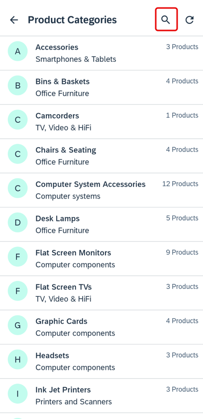

17. Try it out: click the **search** item, enter some text, and notice that the product categories that are displayed in the list are now filtered.

    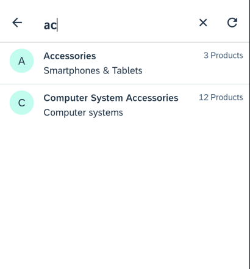

[OPTION END]

[OPTION BEGIN [View-based UI]]

1.  First, right-click the `res/drawable` folder to create a new **Drawable Resource File** **`ic_search_icon.xml`**, and use the following XML content.

    ```XML
    <?xml version="1.0" encoding="utf-8"?>
    <vector xmlns:android="http://schemas.android.com/apk/res/android"
        android:width="24dp"
        android:height="24dp"
        android:viewportWidth="24"
        android:viewportHeight="24">
        <path
            android:fillColor="#000"
            android:pathData="M15.5,14h-0.79l-0.28,-0.27C15.41,12.59 16,11.11 16,9.5 16,5.91 13.09,3 9.5,3S3,5.91 3,9.5 5.91,16 9.5,16c1.61,0 3.09,-0.59 4.23,-1.57l0.27,0.28v0.79l5,4.99L20.49,19l-4.99,-5zM9.5,14C7.01,14 5,11.99 5,9.5S7.01,5 9.5,5 14,7.01 14,9.5 11.99,14 9.5,14z"/>
    </vector>
    ```

    The current menu `res/menu/itemlist_menu.xml` is shared among all list screens. We will now use a new XML file for the **Product Categories** screen.

2.  Right-click the `res/menu` folder to add a new **Menu Resource File** named **`product_categories_menu.xml`**, and use the following XML for its contents.

    ```XML
    <?xml version="1.0" encoding="utf-8"?>
    <menu xmlns:android="http://schemas.android.com/apk/res/android"
        xmlns:app="http://schemas.android.com/apk/res-auto">

        <item
            android:id="@+id/action_search"
            android:icon="@drawable/ic_search_icon"
            android:title="Search"
            app:actionViewClass="com.sap.cloud.mobile.fiori.search.FioriSearchView"
            app:showAsAction="always|collapseActionView"
            style="@style/FioriSearchView" />

        <item
            android:id="@+id/menu_refresh"
            android:icon="@drawable/ic_sap_icon_refresh"
            app:showAsAction="always"
            android:title="@string/menu_refresh"/>
    </menu>
    ```

3.  On Windows, press **`Ctrl+N`**, or on a Mac, press **`command+O`**, and type **`ProductCategoryListAdapter`**, to open the `ProductCategoryListAdapter` class, which is in the `ProductCategoriesListFragment.kt` file.

4.  Add the following member and methods to the top of this class.

    ```Kotlin
    var allProductCategories = listOf<ProductCategory>()

    fun setProductCategories(productCategories: MutableList<ProductCategory>) {
        this.productCategories = productCategories
    }
    ```

5.  On Windows, press **`Ctrl+F12`**, or on a Mac, press **`command+F12`**, and type **`setItems`**, to move to the `setItems` method.

6.  Add the following to the top of the function:

    ```Kotlin
    if (allProductCategories.isEmpty()) {
        allProductCategories = currentProductCategories
    }
    ```

7. On Windows, press **`Ctrl+F12`**, or on a Mac, press **`command+F12`**, and type **`onCreateMenu`**, to move to the `onCreateMenu` method.

8. Replace the contents of the method with the following code, which uses the new `product_categories_menu` and sets a listener that will filter the list of categories in the list when text is entered in the search view. (Make sure to import all the un-imported classes with **`alt+Enter`** on Windows or **`option+Enter`** on Macs.)

    ```Kotlin
    menuInflater.inflate(R.menu.product_categories_menu, menu)
    val searchView = menu.findItem(R.id.action_search).actionView as FioriSearchView
    searchView.setBackgroundResource(R.color.transparent)
    // make sure to import androidx.appcompat.widget.SearchView
    searchView.setOnQueryTextListener(object: SearchView.OnQueryTextListener {
        override fun onQueryTextSubmit(s: String): Boolean {
            return false
        }

        override fun onQueryTextChange(newText: String): Boolean {
            adapter?.let { adapter ->
                val filteredCategoriesList = mutableListOf<ProductCategory>()
                if (newText.trim().isNotEmpty()) {
                    for (i in adapter.allProductCategories.indices) {
                        val pc = adapter.allProductCategories[i]
                        pc.categoryName?.let {
                            if (it.lowercase().contains(newText.lowercase())) {
                                filteredCategoriesList.add(pc)
                            }
                        }
                    }
                }
                else {
                    for (i in adapter.allProductCategories.indices) {
                        filteredCategoriesList.add(adapter.allProductCategories[i])
                    }
                }
                adapter.setProductCategories(filteredCategoriesList)
                return false
            } ?: return false
        }
    })
    ```

9.  Run the app again. You'll notice that there is now a search toolbar item.

    

10. Try it out: click the **search** item, enter some text, press **`Enter`**, and notice that the product categories that are displayed in the list are now filtered.

    

[OPTION END]

>Further information on the Fiori search UI can be found at [SAP Fiori for Android Design Guidelines](https://experience.sap.com/fiori-design-android/search-2/) and [Fiori Search User Interface](https://help.sap.com/doc/f53c64b93e5140918d676b927a3cd65b/Cloud/en-US/docs-en/guides/features/fiori-ui/android/fiori-search-ui.html).


### Add a Top Products section with a `CollectionView`


[OPTION BEGIN [Jetpack Compose-based UI]]

In this section, you will add a Top Products section to the **Products** screen, which displays the products that have the most sales, as shown below.


First, we'll generate additional sales data in the sample OData service.

1.  In **SAP Mobile Services cockpit**, navigate to **Mobile Applications** > **Native/MDK** > **btp.sdk.wizapp** and go to **Sample OData ESPM**.

2.  Change the **Entity Sets** dropdown to **`SalesOrderItems`** and then click the **generate sample sales orders** icon five times. This will create additional sales order items, which we can use to base our top products on, based on the quantity sold.

    

3.  In Android Studio, on Windows, press **`Ctrl+Shift+N`**, or on a Mac, press **`command+Shift+O`**, and type **`ProductEntitiesScreen`**, to open `ProductEntitiesScreen.kt`.

4.  Add the following import libraries to the top of the document:

    ```Kotlin
    import android.util.Log
    import com.sap.cloud.android.odata.espmcontainer.ESPMContainerMetadata
    import com.sap.cloud.android.odata.espmcontainer.SalesOrderItem
    import com.sap.cloud.mobile.fiori.compose.objectcell.ui.FioriCollectionViewLine
    import com.sap.cloud.mobile.kotlin.odata.DataQuery
    import com.sap.cloud.mobile.kotlin.odata.http.HttpHeaders
    import kotlinx.coroutines.runBlocking
    import java.util.LinkedList
    ```

5.  Add the following variables to the bottom of the file:

    ```Kotlin
    private var salesList = HashMap<String, Int>()
    private val productTracker = HashMap<String, Product>()
    private val productCollectionViewDataList = mutableListOf<FioriCollectionViewData>()
    private val productList = mutableListOf<Product>()
    ```

6. Add the following method after the new added variables:

    ```Kotlin
    // Function to query the products
    private suspend fun queryProducts() {
        val httpHeaders: HttpHeaders = if (EntityMediaResource.isV4(SAPServiceManager.eSPMContainer!!.metadata.versionCode) && EntityMediaResource.hasMediaResources(ESPMContainerMetadata.EntityTypes.product)) {
            val header = HttpHeaders()
            header.set("Accept", "application/json;odata.metadata=full")
            header
        } else HttpHeaders.empty
        val queryProduct = DataQuery().orderBy(Product.productID)
        Log.d("ProductEntitiesScreen", "CollectionView: $queryProduct")
        SAPServiceManager.eSPMContainer?.let{
            it.getProducts(queryProduct, httpHeaders).forEach {product ->
                Log.d("ProductEntitiesScreen", "CollectionView ${product.name} : ${product.productID} : ${product.price}")
                productTracker[product.productID.toString()] = product
            }
            Log.d("ProductEntitiesScreen", "CollectionView: size of topProducts = ${productTracker.size}")
            //Order product list by the sorted sales list
            for ((key, value) in salesList) {
                val product = productTracker[key] ?: continue
                productList.add(product)

                val data = product.pictureUrl?.let {
                    FioriCollectionViewData(
                        avatarImage = FioriImage(EntityMediaResource.getMediaResourceUrl(product, SAPServiceManager.serviceRoot)!!),
                        headline = product.name,
                        subheadline = product.categoryName + ""
                    )
                } ?: FioriCollectionViewData(// No picture is available, so use a character from the product string as the image thumbnail
                    avatarText = product.name.substring(0, 1),
                    headline = product.name,
                    subheadline = product.categoryName + ""
                )
                productCollectionViewDataList.add(data)
            }
        }
    }

    // Query the SalesOrderItems and order by gross amount received from sales
    // Change the orderBy arguments to SalesOrderItem.productID to rearrange the CollectionView order of products
    private suspend fun querySales() {
        val httpHeaders: HttpHeaders = if (EntityMediaResource.isV4(SAPServiceManager.eSPMContainer!!.metadata.versionCode) && EntityMediaResource.hasMediaResources(ESPMContainerMetadata.EntityTypes.salesOrderItem)) {
            val header = HttpHeaders()
            header.set("Accept", "application/json;odata.metadata=full")
            header
        } else HttpHeaders.empty
        val querySales = DataQuery().orderBy(SalesOrderItem.productID)
        SAPServiceManager.eSPMContainer?.let{
            it.getSalesOrderItems(querySales, httpHeaders).forEach {sale ->
                if (salesList.containsKey(sale.productID.toString())) {
                    salesList[sale.productID.toString()] = salesList[sale.productID.toString()]!! + sale.quantity
                } else {
                    salesList[sale.productID.toString()] = sale.quantity
                }
                Log.d("ProductEntitiesScreen","CollectionView ${sale.productID} : ${sale.quantity} : ${sale.grossAmount}")
            }
            salesList = sortByValue(salesList)
            Log.d("ProductEntitiesScreen", "CollectionView: salesList size = ${salesList.size}")
            queryProducts()
        }
    }

    // Function to sort hashmap by values
    private fun sortByValue(hashmap: HashMap<String, Int>): HashMap<String, Int> {
        // Create a list from elements of HashMap
        val list: MutableList<Map.Entry<String, Int>> = LinkedList<Map.Entry<String, Int>>(hashmap.entries)

        // Sort the list
        list.sortWith { o1, o2 -> o2.value.compareTo(o1.value) }

        // Put data from sorted list into the linked hashmap
        val temp: HashMap<String, Int> = LinkedHashMap<String, Int>()
        for ((key, value) in list) {
            temp[key] = value
            Log.d("ProductEntitiesScreen", "CollectionView: id = $key, count = $value")
        }
        return temp
    }
    ```

7. In the body of `ProductEntitiesScreen`, add the following variable:

    ```Kotlin
    var showCollectionView = true
    ```

8. Before the `if (entities.loadState.refresh == LoadState.Loading) {` line and after `FioriDivider()`, add the following code to add a `CollectionView` to the product list screen:

    ```Kotlin
    if (showCollectionView) {
        runBlocking {
            querySales()
        }
        FioriCollectionViewLine(
            label = "Top Products",
            data = productCollectionViewDataList,
            onClick = { position, _ -> // If any object is clicked in CollectionView then the Product's detail page for that object will open
                Log.d("ProductEntitiesScreen", "You clicked on: ${productList[position].name}(${productList[position].productID})")
                onClickChange(productList[position])
            },
            footerButton = FooterButton(
                label = "SEE ALL (${productTracker.size})",
                onClick = { // If the footer "SEE ALL" is clicked then the Products page will open
                    showCollectionView = false
                    viewModel.refreshEntities()
                }),
            scrollable = true
        )
    }
    ```

9. Run the app. You'll notice that the **Products** screen now has a component at the top of the screen that allows horizontal scrolling to view the top products. Tap a product to see more details. Alternatively, tap **SEE ALL** to see all the products.

    

[OPTION END]

[OPTION BEGIN [View-based UI]]

In this section, you will add a Top Products section to the **Products** screen, which displays the products that have the most sales, as shown below.


First, we'll generate additional sales data in the sample OData service.

1.  In **SAP Mobile Services cockpit**, navigate to **Mobile Applications** > **Native/Hybrid** > **btp.sdk.wizapp** and go to **Sample OData ESPM**.

2.  Change the **Entity Sets** dropdown to **`SalesOrderItems`** and then click the **generate sample sales orders** icon five times. This will create additional sales order items, which we can use to base our top products on, based on the quantity sold.

    

3.  In Android Studio, on Windows, press **`Ctrl+Shift+N`**, or on a Mac, press **`command+Shift+O`**, and type **`fragment_entityitem_list`**, to open `fragment_entityitem_list.xml`.

4.  Replace the `fragment_entityitem_list.xml` content with the following code. This adds the `CollectionView` to the **Products** pane when created.

    ```XML
    <?xml version="1.0" encoding="utf-8"?>
    <FrameLayout xmlns:android="http://schemas.android.com/apk/res/android"
        xmlns:app="http://schemas.android.com/apk/res-auto"
        xmlns:tools="http://schemas.android.com/tools"
        android:layout_width="match_parent"
        android:layout_height="match_parent">

        <com.google.android.material.floatingactionbutton.FloatingActionButton
            android:id="@+id/fab"
            android:layout_width="wrap_content"
            android:layout_height="wrap_content"
            android:layout_gravity="bottom|end"
            android:layout_margin="@dimen/fab_margin"
            android:src="@drawable/ic_sap_icon_add"
            app:tint="@color/colorWhite"
            app:backgroundTint="?attr/sap_fiori_color_accent_7"
            app:fabSize="normal" />

        <LinearLayout
            android:layout_width="match_parent"
            android:layout_height="match_parent"
            android:orientation="vertical"
            android:id="@+id/wrapperLayout" >

            <com.sap.cloud.mobile.fiori.object.CollectionView
                app:layout_scrollFlags="scroll|enterAlways"
                android:id="@+id/collectionView"
                android:layout_height="wrap_content"
                android:layout_width="match_parent"
                android:background="@color/transparent"
                tools:minHeight="200dp">
            </com.sap.cloud.mobile.fiori.object.CollectionView>

            <androidx.swiperefreshlayout.widget.SwipeRefreshLayout
                android:id="@+id/swiperefresh"
                android:layout_width="match_parent"
                android:layout_height="match_parent">

                <androidx.recyclerview.widget.RecyclerView
                    android:id="@+id/item_list"
                    android:name="ItemListFragment"
                    android:layout_width="match_parent"
                    android:layout_height="match_parent"
                    app:layoutManager="androidx.recyclerview.widget.LinearLayoutManager" />
            </androidx.swiperefreshlayout.widget.SwipeRefreshLayout>

        </LinearLayout>

    </FrameLayout>
    ```

5.  On Windows, press **`Ctrl+N`**, or on a Mac, press **`command+O`**, and type **`ProductsListFragment`**, to open `ProductsListFragment.kt`.

6.  Add the following import libraries to the top of the document:

    ```Kotlin
    import android.widget.LinearLayout
    import androidx.fragment.app.FragmentActivity
    import com.sap.cloud.android.odata.espmcontainer.SalesOrderItem
    import com.sap.cloud.mobile.fiori.common.FioriItemClickListener
    import com.sap.cloud.mobile.fiori.`object`.AbstractEntityCell
    import com.sap.cloud.mobile.fiori.`object`.CollectionView
    import com.sap.cloud.mobile.fiori.`object`.CollectionViewItem
    import com.sap.cloud.mobile.odata.DataQuery
    import com.sap.cloud.mobile.odata.http.HttpHeaders

    import java.util.*
    import kotlin.collections.ArrayList
    import kotlin.collections.HashMap
    import kotlin.collections.LinkedHashMap
    ```

7.  Add the following variables to the top of the `ProductsListFragment` class:

    ```Kotlin
    private val productList = arrayListOf<Product>()
    private var salesList = HashMap<String, Int>()
    private val productTracker = HashMap<String, Product>()
    ```

8.  On Windows, press **`ctrl+F12`**, or on a Mac, press **`command+F12`**, and type **`resetSelected`**, to move to the `resetSelected` method.

9.  Change the modifier from `private` to `internal`

10. Do the same to `resetPreviouslyClicked` method.

11. Add the following method to the `companion object` section:

    ```Kotlin
    // Function to sort hashmap by values
    fun sortByValue(hashmap: HashMap<String, Int>): HashMap<String, Int> {
        // Create a list from elements of HashMap
        val list: MutableList<Map.Entry<String, Int>> = LinkedList<Map.Entry<String, Int>>(hashmap.entries)

        // Sort the list
        list.sortWith { o1, o2 ->
            o2.value.compareTo(o1.value)
        }

        // Put data from sorted list into the linked hashmap
        val temp: HashMap<String, Int> = LinkedHashMap<String, Int>()
        for ((key, value) in list) {
            temp[key] = value
            LOGGER.debug("CollectionView: id = $key, count = $value")
        }
        return temp
    }
    ```

12. Add the following methods to the class:

    ```Kotlin
    // Function to query the products
    private fun queryProducts() {
        val sapServiceManager = (currentActivity.application as SAPWizardApplication).sapServiceManager
        val query = DataQuery().orderBy(Product.productID)
        LOGGER.debug("CollectionView $query")
        val espmContainer = sapServiceManager?.eSPMContainer
        espmContainer?.let {
            val httpHeaders: HttpHeaders = if (EntityMediaResource.isV4(it.metadata.versionCode) && EntityMediaResource.hasMediaResources(EntityTypes.product)) {
                val header = HttpHeaders()
                header.set("Accept", "application/json;odata.metadata=full")
                header
            } else HttpHeaders.empty
            it.getProductsAsync(query, {queryProducts: List<Product> ->
                LOGGER.debug("CollectionView: executed query in onCreate")
                for (product in queryProducts) {
                    LOGGER.debug("CollectionView ${product.name} : ${product.productID} : ${product.price}")
                    productTracker[product.productID.toString()] = product
                }

                LOGGER.debug("CollectionView: size of topProducts = ${queryProducts.size}")
                createTopProductsList()
                val cv: CollectionView = currentActivity.findViewById(R.id.collectionView)
                createCollectionView(cv)
            }, {re: RuntimeException -> LOGGER.debug("CollectionView: An error occurred during products async query: ${re.message}")
            }, httpHeaders)
        }
    }

    // Function to order product list by the sorted sales list
    private fun createTopProductsList() {
      for ((key, value) in salesList) {
        productList.add(productTracker[key]!!)
      }
    }

    // Function to set features of the CollectionView
    private fun createCollectionView(cv: CollectionView) {
        LOGGER.debug("CollectionView: in createCollectionView method")
        cv.apply {
          setHeader(" Top Products")
          setFooter(" SEE ALL (${productTracker.size})")

          // If the footer "SEE ALL" is clicked then the Products page will open
          setFooterClickListener {
              visibility = View.GONE
          }

          // If any object is clicked in CollectionView then the Product's detail page for that object will open
          setItemClickListener(object: FioriItemClickListener {
              override fun onClick(view: View, position: Int) {
                  LOGGER.debug("You clicked on: ${productList[position].name}(${productList[position].productID})")
                  showProductDetailActivity(view.context, UIConstants.OP_READ, productList[position])
              }

              override fun onLongClick(view: View, position: Int) {
                  Toast.makeText(currentActivity.applicationContext, "You long clicked on: $position", Toast.LENGTH_SHORT).show()
              }
          })

          val collectionViewAdapter = CollectionViewAdapter(currentActivity, productList.toList())
          setCollectionViewAdapter(collectionViewAdapter)
        }

        if (resources.getBoolean(R.bool.two_pane)) {
            refreshLayout = currentActivity.findViewById(R.id.swiperefresh)
            val linearLayout = currentActivity.findViewById<LinearLayout>(R.id.wrapperLayout)
            val height = linearLayout.height - cv.height
            refreshLayout.minimumHeight = height
        }
    }

    // Opens the product's detail page activity
    private fun showProductDetailActivity(context: Context, operation: String, productEntity: Product?) {
        productEntity?.let {
          LOGGER.debug("within showProductDetailActivity for ${it.name}")
          val isNavigationDisabled = (currentActivity as ProductsActivity).isNavigationDisabled
          if (isNavigationDisabled) {
              Toast.makeText(currentActivity, "Please save your changes first...", Toast.LENGTH_LONG).show()
          } else {
              adapter?.resetSelected()
              adapter?.resetPreviouslyClicked()
              viewModel.setSelectedEntity(it)
              listener?.onFragmentStateChange(UIConstants.EVENT_ITEM_CLICKED, it)
          }
        }
    }

    private class CollectionViewAdapter(activity: FragmentActivity, productList: List<Product>) : CollectionView.CollectionViewAdapter() {
        private val products: List<Product>
        private val currentActivity: FragmentActivity

        override fun onBindViewHolder(collectionViewItemHolder: CollectionViewItemHolder, i: Int) {
            val cvi: CollectionViewItem = collectionViewItemHolder.collectionViewItem
            val prod = products[i]
            val productName = prod.name
            cvi.apply {
                detailImage = null
                headline = productName
                subheadline = prod.categoryName + ""
                imageOutlineShape = AbstractEntityCell.IMAGE_SHAPE_OVAL
                prod.pictureUrl?.let {
                    val sapServiceManager = (currentActivity.application as SAPWizardApplication).sapServiceManager
                    prepareDetailImageView().scaleType = ImageView.ScaleType.FIT_CENTER
                    sapServiceManager?.let {sapServiceManager ->
                        Glide.with(currentActivity.applicationContext)
                                .load(EntityMediaResource.getMediaResourceUrl(prod, sapServiceManager.serviceRoot)) // Import com.bumptech.glide.Glide for RequestOptions()
                                .apply(RequestOptions().fitCenter())
                                .transition(DrawableTransitionOptions.withCrossFade())
                                .into(prepareDetailImageView())
                    }
                } ?: run { // No picture is available, so use a character from the product string as the image thumbnail
                    detailImageCharacter = productName.substring(0, 1)
                    setDetailCharacterBackgroundTintList(com.sap.cloud.mobile.fiori.R.color.sap_ui_contact_placeholder_color_1)
                }
            }
        }

        override fun getItemCount(): Int {
            return products.size
        }

        init {
            products = productList
            currentActivity = activity
        }
    }
    ```

13. On Windows, press **`Ctrl+F12`**, or on a Mac, press **`command+F12`**, and type **`prepareViewModel`**, to move to the `prepareViewModel` method.

14. Replace the `ViewModelProvider(currentActivity).get(ProductViewModel::class.java)` line of the method with the following code:

    ```Kotlin
    ViewModelProvider(currentActivity).get(ProductViewModel::class.java).also {
        it.initialRead{errorMessage ->
            showError(errorMessage)
        }
        val cv: CollectionView = currentActivity.findViewById(R.id.collectionView)
        createCollectionView(cv)
    }
    ```

15. On Windows, press **`Ctrl+F12`**, or on a Mac, press **`command+F12`**, and type **`onCreate`**, to move to the `onCreate` method.

16. Add the following lines of code at the end of the method:

    ```Kotlin
    // Query the SalesOrderItems and order by gross amount received from sales
    // Change the orderBy arguments to SalesOrderItem.productID to rearrange the CollectionView order of products
    val dq = DataQuery().orderBy(SalesOrderItem.productID)
    // Get the DataService class, which we will use to query the back-end OData service
    val espmContainer = sapServiceManager?.eSPMContainer
    espmContainer?.let {
        val httpHeaders: HttpHeaders = if (EntityMediaResource.isV4(it.metadata.versionCode) && EntityMediaResource.hasMediaResources(EntityTypes.salesOrderItem)) {
            val header = HttpHeaders()
            header.set("Accept", "application/json;odata.metadata=full")
            header
        } else HttpHeaders.empty
        it.getSalesOrderItemsAsync(dq, { querySales: List<SalesOrderItem>? ->
            LOGGER.debug("CollectionView: executed sales order query in onCreate")
            querySales?.let { querysales ->
                for (sale in querysales) {
                    if (salesList.containsKey(sale.productID.toString())) {
                        salesList[sale.productID.toString()] = salesList[sale.productID.toString()]!!.toInt() + sale.quantity
                    } else {
                        salesList[sale.productID.toString()] = sale.quantity
                    }
                    LOGGER.debug("CollectionView ${sale.productID} : ${sale.quantity} : ${sale.grossAmount}")
                }
                salesList = sortByValue(salesList)
                LOGGER.debug("CollectionView: salesList size = ${salesList.size}")
                queryProducts()
            } ?: LOGGER.debug("CollectionView: sales query list is null")
        }, { re: RuntimeException -> LOGGER.debug("CollectionView: An error occurred during async sales query: ${re.message}")
        }, httpHeaders)
    }
    ```

17. Run the app. You'll notice that the **Products** screen now has a component at the top of the screen that allows horizontal scrolling to view the top products. Tap a product to see more details. Alternatively, tap **SEE ALL** to see all the products.

    

[OPTION END]

>For more details, see [Collection View in SAP Fiori for Android Design Guidelines](https://experience.sap.com/fiori-design-android/collection-view/) and [Collection View](https://help.sap.com/doc/f53c64b93e5140918d676b927a3cd65b/Cloud/en-US/docs-en/guides/features/fiori-ui/android/collection-view.html)

>For more information on SAP Fiori for Android and the generated app, see [Fiori UI Overview](https://help.sap.com/doc/f53c64b93e5140918d676b927a3cd65b/Cloud/en-US/docs-en/guides/features/fiori-ui/android/overview.html), [SAP Fiori for Android Design Guidelines](https://experience.sap.com/fiori-design-android/explore/), [Fiori UI Demo Application](https://github.com/SAP/cloud-sdk-android-fiori-ui-components) and the `WizardAppReadme.md` file located in the generated app.

Congratulations! You have now made use of SAP Fiori for Android and have an understanding of some of the ways that the wizard-generated application can be customized to show different fields on the list screens, add or remove menu items, perform a search, and use a collection view.

---
