# Offline-Enable Your Android Application
<!-- description --> Enable offline OData in your Android application, resulting in an application that can be used without a network connection and that performs data requests with less latency.

## You will learn
- How the offline feature works, through demonstration
- How the synchronization code works
- How to handle errors that occur while syncing
---

### Generate and run an offline app


1.  Follow the instructions at [Try Out the SAP BTP SDK Wizard for Android](sdk-android-wizard-app) to create a new application using the SAP BTP SDK Wizard for Android and select **Offline** for the **OData** option on the **Project Features** tab. The push feature is not needed for this application.

    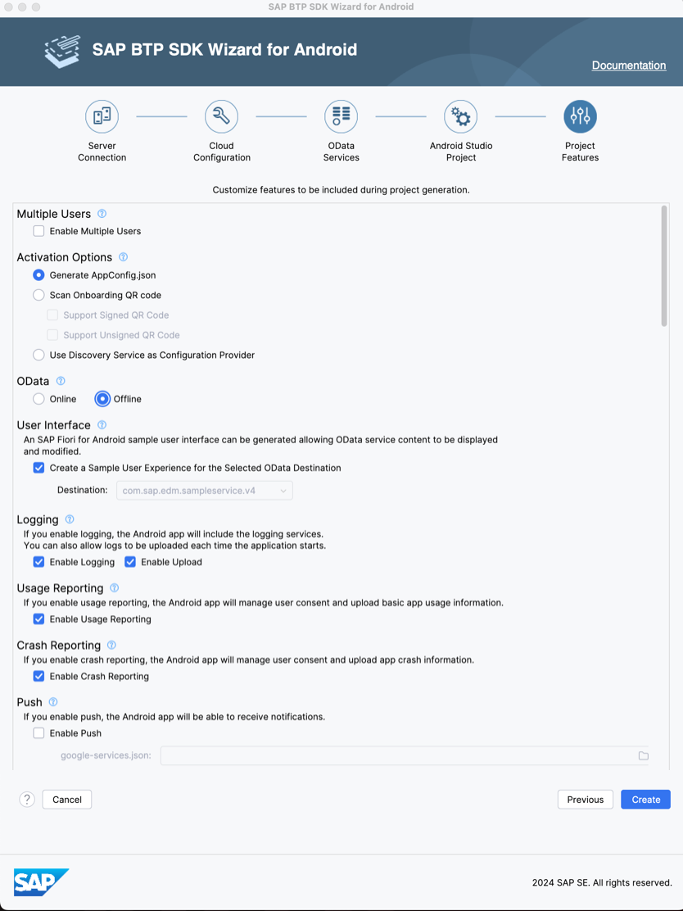

2.  Run the app. After the login process, a screen is displayed explaining that the offline store is opening. As the screen suggests, opening the offline store for the first time can take up to a few minutes. One technique to decrease this initial time is to only download data that is relevant to the user, such as customers that belong in their sales region.

    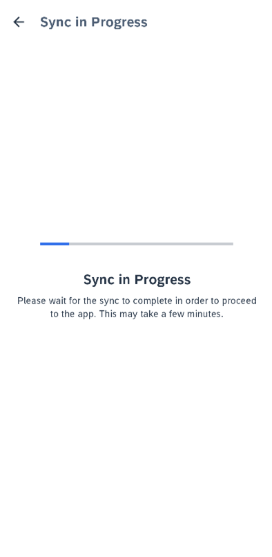

3.  When you get to the app's home page, turn on **Airplane mode** on your device, or disable Wi-Fi and data.

    

4.  The entity list screen is populated based on the `metadata.xml` file retrieved when the application was created. Tap the **Products** list item.

    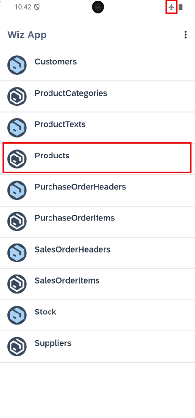

    The **Products** screen makes a data request to display the available products. Notice that it succeeds without a working network connection. The data request is fulfilled from the offline store that was previously created and populated on the device. Tap the **Accessories** item to display the detail screen.

    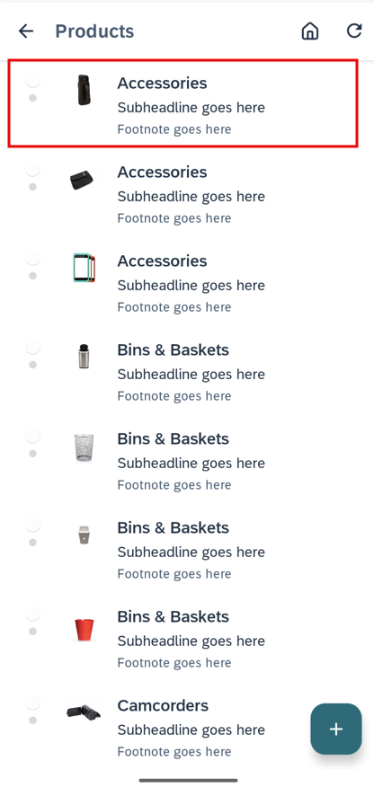

5.  On the detail screen, tap the edit toolbar icon.

    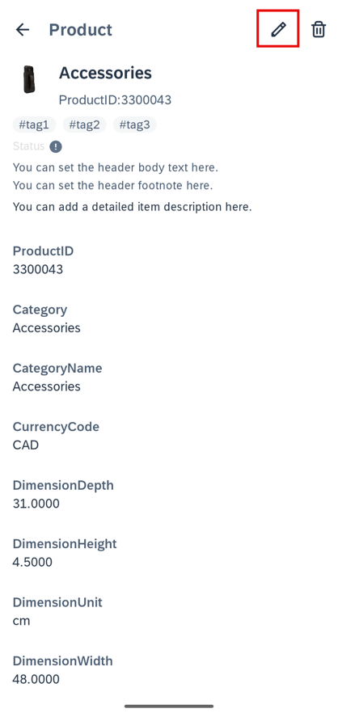

6.  Make a change to the currency code and tap the save toolbar icon.

    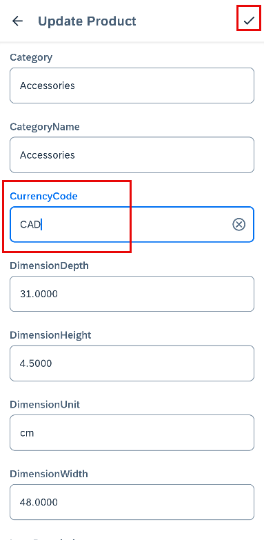

7.  Navigate back to the app's **Home** screen and tap **Synchronize** using the three-dot-menu in the top right of the title bar.

    

    The sync should fail because you haven't turned airplane mode off yet.

    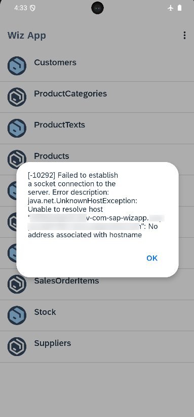

8.  Turn off airplane mode or re-enable Wi-Fi/data and attempt a sync again. You will see a notification that describes the sync action.

    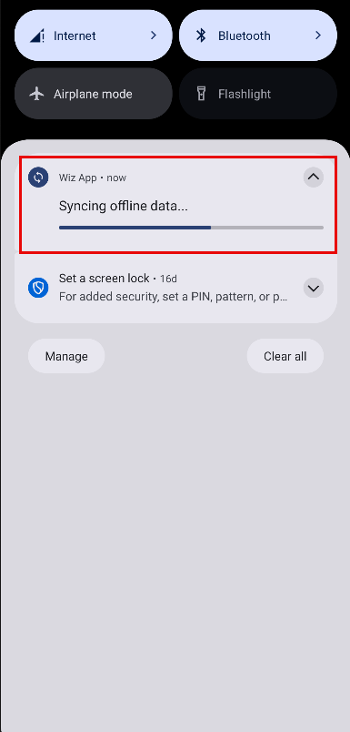

    When the sync completes, the change you made will have been applied to the back end.


### Examine the encryption key


To protect the data in offline store, you must enable offline store encryption by supplying an encryption key.

1.  In Android Studio, on Windows, press **`Ctrl+N`**, or on a Mac, press **`command+O`**, and type **`OfflineWorkerUtil`**, to open `OfflineWorkerUtil.kt`.

2.  On Windows, press **`Ctrl+F12`**, or on a Mac, press **`command+F12`**, and type **`initializeOffline`**, to move to the `initializeOffline` method. Call the setter of `storeEncryptionKey` method of the `OfflineODataParameters` instance to encrypt the offline store. In single user mode, before you can get the encryption key using `UserSecureStoreDelegate`, you must generate and save an encryption key to `UserSecureStore` first.

    ```Kotlin
    val encryptionKey = if (runtimeMultipleUserMode) {
        UserSecureStoreDelegate.getInstance().getOfflineEncryptionKey()
    } else { //If is single user mode, create and save a key into user secure store for accessing offline DB
        if (UserSecureStoreDelegate.getInstance().getData<String>(OFFLINE_DATASTORE_ENCRYPTION_KEY) == null) {
            val bytes = ByteArray(32)
            val random = SecureRandom()
            random.nextBytes(bytes)
            val key = Base64.encodeToString(bytes, Base64.NO_WRAP)
            UserSecureStoreDelegate.getInstance().saveData(OFFLINE_DATASTORE_ENCRYPTION_KEY, key)
            Arrays.fill(bytes, 0.toByte())
            key
        } else {
            UserSecureStoreDelegate.getInstance().getData<String>(OFFLINE_DATASTORE_ENCRYPTION_KEY)
        }
    }
    storeEncryptionKey = encryptionKey
    ```

>For additional information about multiple user mode, see [Enable Multi-User Mode for Your Android Application](sdk-android-wizard-app-multiuser).


### Examine the defining queries


[OPTION BEGIN [Jetpack Compose-based UI]]

The offline store is populated based on objects called in using `OfflineODataDefiningQuery`. The defining queries are located in `OfflineWorkerUtil.kt`, in the `buildOfflineODataProvider` method.

[OPTION END]

[OPTION BEGIN [View-based UI]]

The offline store is populated based on objects called in using `OfflineODataDefiningQuery`. The defining queries are located in `OfflineWorkerUtil.kt`, in the `initializeOffline` method.

[OPTION END]

```Kotlin
val customersQuery = OfflineODataDefiningQuery("Customers", "Customers", false)
val productsQuery = OfflineODataDefiningQuery("Products", "Products", true)
```

Defining queries tell the `OfflineODataProvider` (the class that manages the offline store) which entity sets to store on the device. In the case of the wizard-generated application, there is a defining query for each available entity by default, meaning that each entity is stored offline and available if the user doesn't have an internet connection. For more information, see [Defining Queries](https://help.sap.com/doc/f53c64b93e5140918d676b927a3cd65b/Cloud/en-US/docs-en/guides/features/offline/common/defining-an-application-configuration-file/defining-queries.html).

>With an offline-enabled app, requests made against the entity sets that are included in the defining requests will always be fulfilled from the local offline store.


### Examine the offline service and service manager


The application allows users to make changes against a local offline store and synchronize manually at any time. The sync operation is performed by a [worker](https://developer.android.com/develop/background-work/background-tasks/persistent). There are three operations that must be implemented in order to use the offline store functionality: `open`, `download`, and `upload`. As their names suggest, the operations open the offline store, download server changes, and upload user changes, respectively. In the wizard-generated application, `OfflineOpenWorker` implements `open` during initialization and `OfflineSyncWorker` implements a sync operation, which requires `upload` first, and then `download`.

[OPTION BEGIN [Jetpack Compose-based UI]]

1.  In Android Studio, on Windows, press **`Ctrl+N`**, or on a Mac, press **`command+O`**, and type **`OfflineOpenWorker`** to open `OfflineOpenWorker.kt` and examine the `open` method.

    ```Kotlin
    override suspend fun doWork(): Result = withContext(IO) {
        ... ...
        try {
            result = suspendOpen()
            ... ...
        } finally {
            ... ...
        }
        ... ...
    }

    private suspend fun suspendOpen(): Result {
        try {
            OfflineWorkerUtil.offlineODataProvider?.open()
            return Result.success()
        } catch (exception: OfflineODataException) {
            ... ...
        }
    }
    ```

    The worker's work is to call the `open` method of the `OfflineODataProvider` class to perform the open operation and pass the given callbacks through.

    The `OfflineOpenWorker` class is called by the `open` method in `OfflineWorkerUtil.kt`, which is called by `OfflineOpenViewModel` when the user logs in to the application.

    ```Kotlin
    // In OfflineWorkerUtil.kt
    fun open(context: Context): UUID {
        ... ...
        val openRequest = OneTimeWorkRequestBuilder<OfflineOpenWorker>()
            .setConstraints(constraints)
            .build()
        ... ...
    }
    ```

    ```Kotlin
    // In OfflineOpenViewModel.kt
    fun startOpenOffline() {
        OfflineWorkerUtil.addProgressListener(progressListener)
        _uiState.update { SyncUIState() } //reset ui state for relaunch
        val openRequestId = OfflineWorkerUtil.open(getApplication())
        ... ...
    }
    ```

2.  In Android Studio, on Windows, press **`Ctrl+N`**, or on a Mac, press **`command+O`**, and type **`OfflineSyncWorker`** to open `OfflineSyncWorker.kt` and examine the `download` and `upload` methods.

    ```Kotlin
    override suspend fun doWork(): Result = withContext(IO) {
        ... ...

        OfflineWorkerUtil.offlineODataProvider?.let { provider ->
            ... ...
            try {
                OfflineWorkerUtil.addProgressListener(progressListener)
                logger.info("Start uploading data...")
                provider.upload()
                logger.info("Start downloading data...")
                startPointForSync = progressListener.totalStepsForTwoProgresses / 2
                provider.download()
            } catch (exception: OfflineODataException) {
                ... ...
            } finally {
                ... ...
            }
        }

        ... ...
    }
    ```

    The worker's work is to call the `download` and `upload` method of the `OfflineODataProvider` class to perform the sync operation.

    The `OfflineSyncWorker` class is called by the `sync` method in `OfflineWorkerUtil.kt`, which is called by `EntitySetViewModel` when the user wants to perform a sync. When an entity is created locally in the offline store, its primary key is left unset. This is because when the user performs an `upload`, the server will set the primary key for the client. An `upload` and a `download` are normally performed together because the `download` may return updated values from the server, such as a newly-created primary key.

    ```Kotlin
    // In OfflineWorkerUtil.kt
    fun sync(context: Context): UUID {
        ... ...

        val syncRequest = OneTimeWorkRequestBuilder<OfflineSyncWorker>()
            .setConstraints(constraints)
            .build()

        ... ...
    }
    ```

    ```Kotlin
    // In EntitySetViewModel.kt
    fun startSync() {
        val requestId = OfflineWorkerUtil.sync(getApplication())
        ... ...
    }
    ```

[OPTION END]

[OPTION BEGIN [View-based UI]]

1.  In Android Studio, on Windows, press **`Ctrl+N`**, or on a Mac, press **`command+O`**, and type **`OfflineOpenWorker`** to open `OfflineOpenWorker.kt` and examine the `open` method.

    ```Kotlin
    override suspend fun doWork(): Result = withContext(IO) {
        ... ...
        OfflineWorkerUtil.offlineODataProvider?.also { provider ->
            provider.open({
                ... ...
            }, { exception ->
                ... ...
            })
        }
        ... ...
    }
    ```

    The worker's work is to call the `open` method of the `OfflineODataProvider` class to perform the open operation and pass the given callbacks through.

    The `OfflineOpenWorker` class is called by the `open` method in `OfflineWorkerUtil.kt`, which is called by `MainBusinessActivity` when the user logs in to the application.

    ```Kotlin
    // In OfflineWorkerUtil.kt
    @JvmStatic
    fun open(context: Context) {
        ... ...
        openRequest = OneTimeWorkRequestBuilder<OfflineOpenWorker>()
            .setConstraints(constraints)
            .build()
        ... ...
    }
    ```

    ```Kotlin
    // In MainBusinessActivity.kt
    override fun onResume() {
        ... ...
        spforLockAndWipe.getString(SAPWizardApplication.LOCK_WIPE_INVOKING_FLAG, null)?.let {
            ... ...
        } ?: run {
            ... ...
            OfflineWorkerUtil.open(application)
            ... ...
        }
    }
    ```

2.  In Android Studio, on Windows, press **`Ctrl+N`**, or on a Mac, press **`command+O`**, and type **`OfflineSyncWorker`** to open `OfflineSyncWorker.kt` and examine the `download` and `upload` methods.

    ```Kotlin
    override suspend fun doWork(): Result = withContext(IO) {
        ... ...

        OfflineWorkerUtil.offlineODataProvider?.also { provider ->
            ... ...
            provider.upload({
                ... ...
                provider.download({
                    ... ...
                }, {
                    ... ...
                })
            }, {
                ... ...
            })
        }

        ... ...
    }
    ```

    The worker's work is to call the `download` and `upload` method of the `OfflineODataProvider` class to perform the sync operation and pass the given callbacks through.

    The `OfflineSyncWorker` class is called by the `sync` method in `OfflineWorkerUtil.kt`, which is called by `EntitySetListActivity` when the user wants to perform a sync. When an entity is created locally in the offline store, its primary key is left unset. This is because when the user performs an `upload`, the server will set the primary key for the client. An `upload` and a `download` are normally performed together because the `download` may return updated values from the server, such as a newly-created primary key.

    ```Kotlin
    // In OfflineWorkerUtil.kt
    @JvmStatic
    fun sync(context: Context) {
        ... ...

        syncRequest = OneTimeWorkRequestBuilder<OfflineSyncWorker>()
            .setConstraints(constraints)
            .build()

        ... ...
    }
    ```

    ```Kotlin
    // In EntitySetListActivity.kt
    private fun synchronize() {
        OfflineWorkerUtil.sync(applicationContext)
        ... ...
    }
    ```

[OPTION END]

For more information about how the offline store works, see the [Working With Offline Stores](https://help.sap.com/doc/f53c64b93e5140918d676b927a3cd65b/Cloud/en-US/docs-en/guides/features/offline/common/working-with-offline-stores.html).


### Try to introduce a synchronization error


When syncing changes made while offline, conflicts can occur. One example might be if two people attempted to update a description field for the same product. Another might be updating a record that was deleted by another user. The [`ErrorArchive`](https://help.sap.com/doc/f53c64b93e5140918d676b927a3cd65b/Cloud/en-US/docs-en/guides/features/offline/common/handling-errors-and-conflicts/accessing-errorarchive.html) provides a way to see details of any of the conflicts that may have occurred. The following instructions demonstrate how to use `ErrorArchive`.

[OPTION BEGIN [Jetpack Compose-based UI]]

1.  Update a **SalesOrderItem** and change its quantity to be zero and save it. Update a second item and change its quantity to a different non-zero number and save it.

    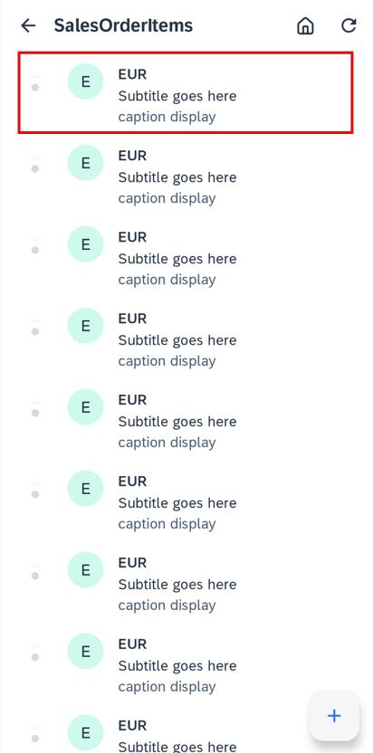

    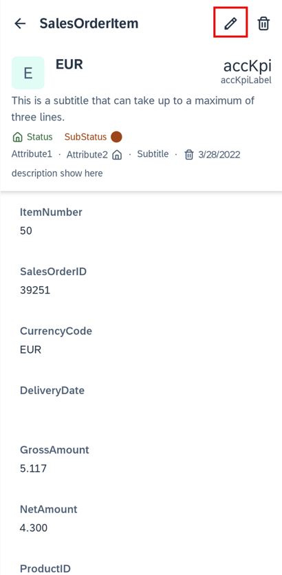

    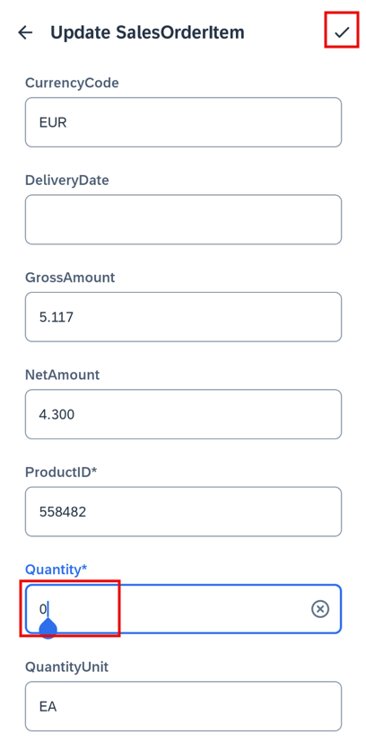

    Notice that the items are now marked with a yellow indicator to indicate that an item has been locally modified but not yet synced.

    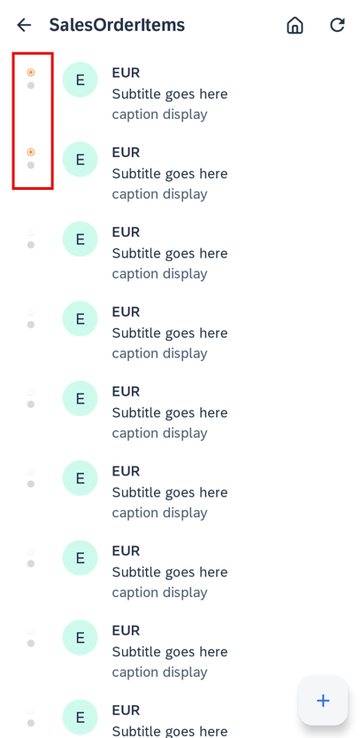

2.  Attempt a sync, and you'll notice that the sync completes, but if you examine the **SalesOrderItems** list, one item has a red mark beside it, indicating it is in an error state. This is because the back end has a check that **SalesOrderItems** cannot have zero for their quantity. This check does not exist in the local offline store, so the update succeeds locally but fails when the offline store is synced.

    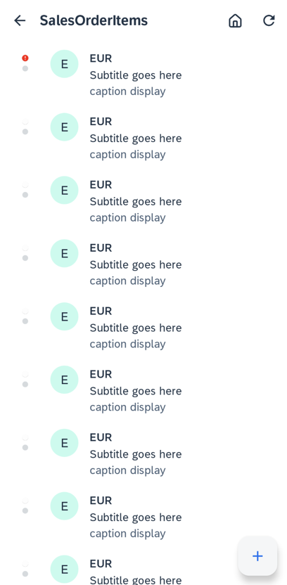

[OPTION END]

[OPTION BEGIN [View-based UI]]

1.  Update a **SalesOrderItem** and change its quantity to be zero and save it. Update a second item and change its quantity to a different non-zero number and save it.

    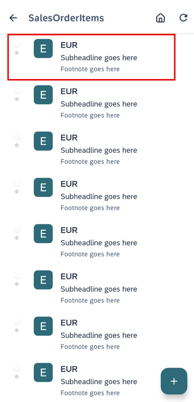

    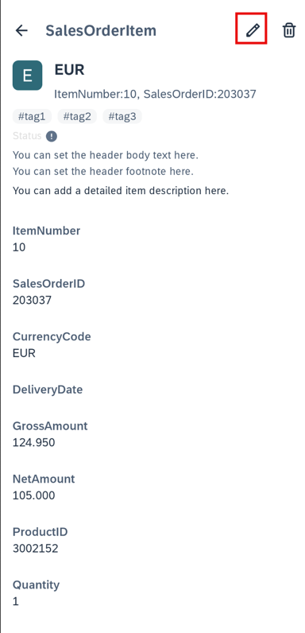

    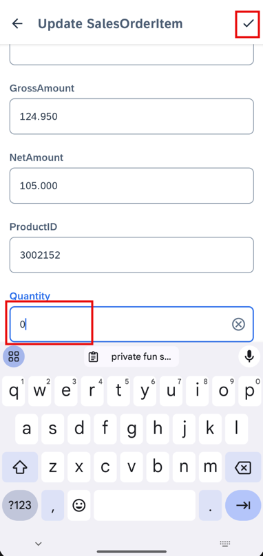

    Notice that the items are now marked with a yellow indicator to indicate that an item has been locally modified but not yet synced.

    

2.  Attempt a sync, and you'll notice that the sync completes, but if you examine the **SalesOrderItems** list, one item has a red mark beside it, indicating it is in an error state. This is because the back end has a check that **SalesOrderItems** cannot have zero for their quantity. This check does not exist in the local offline store, so the update succeeds locally but fails when the offline store is synced.

    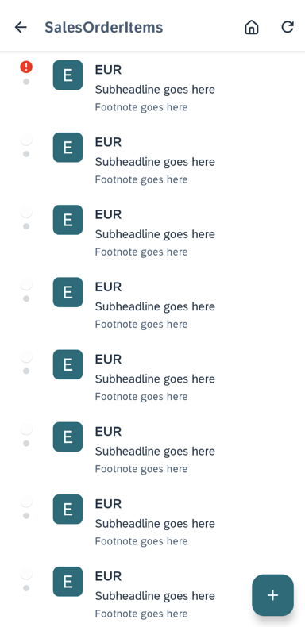

[OPTION END]


### Display `ErrorArchive` details


In this section we will create an **Error Information** screen that displays the details from the `ErrorArchive`.

[OPTION BEGIN [Jetpack Compose-based UI]]

1.  Press **`Shift`** twice and type **`strings.xml`** to open `res\values\strings.xml`.

2.  Add the following values.

    ```XML
    <string name="error_header">Error Information</string>
    <string name="request_method">Request Method</string>
    <string name="request_status">Request Status</string>
    <string name="request_message">Request Message</string>
    <string name="request_body">Request Body</string>
    <string name="request_url">Request URL</string>
    ```

3.  Create a new screen in the `app/kotlin+java/com.sap.wizapp/ui/odata/screens` folder by right-clicking, then selecting **New** > **Kotlin Class/File** > **File**. Name the new file **`ErrorScreen`**.

4.  Replace the `ErrorScreen.kt` generated code with the following code.

    In the package statement and the import, if needed, replace `com.sap.wizapp` with the package name of your project.

    ```Kotlin
    package com.sap.wizapp.ui.odata.screens

    import androidx.compose.foundation.layout.padding
    import androidx.compose.foundation.lazy.LazyColumn
    import androidx.compose.material3.Text
    import androidx.compose.runtime.Composable
    import androidx.compose.ui.Modifier
    import androidx.compose.ui.res.stringResource
    import androidx.compose.ui.unit.dp
    import androidx.lifecycle.viewmodel.compose.viewModel
    import com.sap.cloud.mobile.fiori.compose.common.FioriDivider
    import com.sap.cloud.mobile.fiori.compose.navigation.ui.HeadlineText
    import com.sap.cloud.mobile.fiori.compose.theme.FioriTextStyleOverline
    import com.sap.cloud.mobile.fiori.compose.theme.TextAppearanceFioriSubtitle1
    import com.sap.wizapp.R
    import org.json.JSONObject

    const val ERROR_URL = "requestURL"
    const val ERROR_CODE = "statusCode"
    const val ERROR_METHOD = "method"
    const val ERROR_BODY = "body"
    const val ERROR_MESSAGE = "message"

    @Composable
    fun ErrorScreen(navigateUp: () -> Unit, errorInfo: String?) {
        // Display the error information

        val errorInfoJson = errorInfo?.let{ JSONObject(errorInfo) }
        val errorUrl = errorInfoJson?.getString(ERROR_URL)
        val errorCode = errorInfoJson?.getInt(ERROR_CODE)
        val errorMethod = errorInfoJson?.getString(ERROR_METHOD)
        val errorBody = errorInfoJson?.getString(ERROR_BODY)
        val errorMessage = errorInfoJson?.getString(ERROR_MESSAGE)

        OperationScreen(
            screenSettings = OperationScreenSettings(
                title = stringResource(id = R.string.application_name),
                navigateUp = navigateUp,
            ),
            modifier = Modifier,
            viewModel = viewModel()
        ) {
            LazyColumn {
                item {
                    HeadlineText(
                        text = stringResource(id = R.string.error_header),
                        modifier = Modifier.padding(16.dp)
                    )
                    FioriDivider()
                    Text(
                        text = stringResource(id = R.string.request_message).uppercase(),
                        modifier = Modifier.padding(16.dp),
                        style = FioriTextStyleOverline
                    )
                    Text(
                        text = errorMessage ?: stringResource(id = R.string.request_message),
                        modifier = Modifier.padding(start = 16.dp, end = 16.dp, bottom = 16.dp),
                        style = TextAppearanceFioriSubtitle1
                    )
                    FioriDivider()
                    Text(
                        text = stringResource(id = R.string.request_body).uppercase(),
                        modifier = Modifier.padding(16.dp),
                        style = FioriTextStyleOverline
                    )
                    Text(
                        text = errorBody ?: stringResource(id = R.string.request_body),
                        modifier = Modifier.padding(start = 16.dp, end = 16.dp, bottom = 16.dp),
                        style = TextAppearanceFioriSubtitle1
                    )
                    FioriDivider()
                    Text(
                        text = stringResource(id = R.string.request_url).uppercase(),
                        modifier = Modifier.padding(16.dp),
                        style = FioriTextStyleOverline
                    )
                    Text(
                        text = errorUrl ?: stringResource(id = R.string.request_url),
                        modifier = Modifier.padding(start = 16.dp, end = 16.dp, bottom = 16.dp),
                        style = TextAppearanceFioriSubtitle1
                    )
                    FioriDivider()
                    Text(
                        text = stringResource(id = R.string.request_status).uppercase(),
                        modifier = Modifier.padding(16.dp),
                        style = FioriTextStyleOverline
                    )
                    Text(
                        text = (errorCode ?: 0).toString(),
                        modifier = Modifier.padding(start = 16.dp, bottom = 16.dp),
                        style = TextAppearanceFioriSubtitle1
                    )
                    FioriDivider()
                    Text(
                        text = stringResource(id = R.string.request_method).uppercase(),
                        modifier = Modifier.padding(16.dp),
                        style = FioriTextStyleOverline
                    )
                    Text(
                        text = errorMethod ?: stringResource(id = R.string.request_method),
                        modifier = Modifier.padding(start = 16.dp, bottom = 16.dp),
                        style = TextAppearanceFioriSubtitle1
                    )
                    FioriDivider()
                }
            }
        }
    }
    ```

5.  On Windows, press **`Ctrl+Shift+N`**, or on a Mac, press **`command+shift+O`**, and type **`EntitySetsScreen`** to open `EntitySetsScreen.kt`.

6.  Add a parameter after `navigateToSettings` in the `EntitySetScreen` function:

    ```Kotlin
    @Composable
    fun EntitySetScreen(
        list: List<EntityScreenInfo>,
        onRowClick: (EntityType) -> Unit,
        modifier: Modifier = Modifier,
        navigateToSettings: () -> Unit,
        navigateToErrorScreen: (String) -> Unit
    ) {
    ```

7.  Add the following imports:

    ```Kotlin
    import android.util.Log
    import com.sap.cloud.mobile.kotlin.odata.offline.OfflineODataException
    import org.json.JSONException
    import org.json.JSONObject
    ```

8.  Modify the `EntitySetScreen` in the `EntitySetScreenPreview` function correspondingly.

    ```Kotlin
    @Preview
    @Composable
    fun EntitySetScreenPreview() {
        val entityTypeNames = EntityScreenInfo.entries
        EntitySetScreen(entityTypeNames, { println("click $it row") }, navigateToSettings = {}, navigateToErrorScreen = {})
    }
    ```

9.  In the action tiems list of the `OperationScreen`, modify the action of `ActionItem` `synchronize` from `viewModel::startSync` to the following, which queries the error archive and displays information to the user about the first error encountered after sync finished:

    ```Kotlin
    viewModel.startSync()
    val provider = OfflineWorkerUtil.offlineODataProvider

    try {
        val errorArchive = provider!!.getErrorArchive()

        for (errorEntity in errorArchive) {
            val requestURL = errorEntity.requestURL
            val method = errorEntity.requestMethod
            val message = errorEntity.message
            val statusCode = errorEntity.httpStatusCode ?: 0
            val body = errorEntity.requestBody

            Log.e("ErrorArchive", "RequestURL: $requestURL")
            Log.e("ErrorArchive", "HTTP Status Code: $statusCode")
            Log.e("ErrorArchive", "Method: $method")
            Log.e("ErrorArchive", "Message: $message")
            Log.e("ErrorArchive", "Body: $body")

            val finalMessage = try {
                val jsonObj = message?.let { JSONObject(it) }
                jsonObj?.let {
                    jsonObj.getJSONObject("error").getString("message")
                }
            } catch (e: JSONException) {
                e.printStackTrace()
                message
            }

            val errorInfo = JSONObject().apply {
                                put(ERROR_URL, requestURL)
                                put(ERROR_METHOD, method)
                                put(ERROR_MESSAGE, finalMessage)
                                put(ERROR_CODE, statusCode)
                                put(ERROR_BODY, body)
                            }

            // Reverts all failing entities to the previous state or set
            // offlineODataParameters.setEnableIndividualErrorArchiveDeletion(true);
            // to cause the deleteEntity call to only revert the specified entity
            // https://help.sap.com/doc/f53c64b93e5140918d676b927a3cd65b/Cloud/en-US/docs-en/guides/features/offline/common/handling-failed-requests/reverting-error-state.html
            // provider.deleteEntity(errorEntity, null, null);
            navigateToErrorScreen(errorInfo.toString())
            break //For simplicity, only show the first error encountered
        }
    } catch (e: OfflineODataException) {
        e.printStackTrace()
    }
    ```

    After modification, the `ActionItem` of `synchronize` should look like this:

    ```Kotlin
    ActionItem(
        nameRes = R.string.synchronize_action,
        overflowMode = OverflowMode.ALWAYS_OVERFLOW,
        doAction = {
            viewModel.startSync()
            val provider = OfflineWorkerUtil.offlineODataProvider

            try {
                val errorArchive = provider!!.getErrorArchive()

                for (errorEntity in errorArchive) {
                    val requestURL = errorEntity.requestURL
                    val method = errorEntity.requestMethod
                    val message = errorEntity.message
                    val statusCode = errorEntity.httpStatusCode ?: 0
                    val body = errorEntity.requestBody

                    Log.e("ErrorArchive", "RequestURL: $requestURL")
                    Log.e("ErrorArchive", "HTTP Status Code: $statusCode")
                    Log.e("ErrorArchive", "Method: $method")
                    Log.e("ErrorArchive", "Message: $message")
                    Log.e("ErrorArchive", "Body: $body")

                    val finalMessage = try {
                        val jsonObj = message?.let { JSONObject(it) }
                        jsonObj?.let {
                            jsonObj.getJSONObject("error").getString("message")
                        }
                    } catch (e: JSONException) {
                        e.printStackTrace()
                        message
                    }

                    val errorInfo = JSONObject().apply {
                                        put(ERROR_URL, requestURL)
                                        put(ERROR_METHOD, method)
                                        put(ERROR_MESSAGE, finalMessage)
                                        put(ERROR_CODE, statusCode)
                                        put(ERROR_BODY, body)
                                    }

                    // Reverts all failing entities to the previous state or set
                    // offlineODataParameters.setEnableIndividualErrorArchiveDeletion(true);
                    // to cause the deleteEntity call to only revert the specified entity
                    // https://help.sap.com/doc/f53c64b93e5140918d676b927a3cd65b/Cloud/en-US/docs-en/guides/features/offline/common/handling-failed-requests/reverting-error-state.html
                    // provider.deleteEntity(errorEntity, null, null);
                    navigateToErrorScreen(errorInfo.toString())
                    break //For simplicity, only show the first error encountered
                }
            } catch (e: OfflineODataException) {
                e.printStackTrace()
            }
        }
    ),
    ```

10. On Windows, press **`Ctrl+Shift+N`**, or on a Mac, press **`command+shift+O`**, and type **`ODataNavHost`** to open `ODataNavHost.kt`.

11. Add the following imports:

    ```Kotlin
    import androidx.navigation.NavType
    import androidx.navigation.navArgument
    ```

12. Add a composable component right after `composable(route = EntitySetsDest.route) {}` block:

    ```Kotlin
    composable(
        route = "error/{errorInfo}",
        arguments = listOf(
            navArgument("errorInfo") { type = NavType.StringType }
        )
    ) { backStackEntry ->
        val errorInfo = backStackEntry.arguments?.getString("errorInfo")
        ErrorScreen(navController::navigateUp, errorInfo)
    }
    ```

13. Replace the `composable(route = EntitySetsDest.route) {}` block with the following:

    ```Kotlin
    composable(route = EntitySetsDest.route) {
        EntitySetScreen(
            getEntitySetScreenInfoList(),
            navController::navigateToEntityList,
            navigateToSettings = { navController.navigate(SETTINGS_SCREEN_ROUTE) },
            navigateToErrorScreen = { errorInfo ->
                navController.navigate("error/${errorInfo}")
            }
        )
    }
    ```

14. Run the app again, and re-attempt the sync. When the sync fails, you should see the following error screen.

    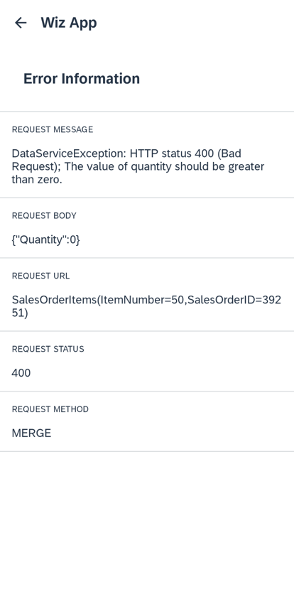

    You can see that the HTTP status code, method, and message are included. When the application attempted a sync, the entity being updated didn't pass the backend checks and produced a `DataServiceException` and is now in the error state. All entities that did not produce errors are successfully synced. One way to correct the exception would be to change the quantity from 0 to a valid positive number. Another would be to delete the `ErrorArchive` entry, reverting the entity to its previous state. For more information on error handling, see [Handling Errors and Conflicts](https://help.sap.com/doc/f53c64b93e5140918d676b927a3cd65b/Cloud/en-US/docs-en/guides/features/offline/common/handling-errors-and-conflicts/handling-errors-and-conflicts.html) and [Handling Failed Requests](https://help.sap.com/doc/f53c64b93e5140918d676b927a3cd65b/Cloud/en-US/docs-en/guides/features/offline/common/handling-failed-requests/handling-failed-requests.html).

[OPTION END]

[OPTION BEGIN [View-based UI]]

1.  Press **`Shift`** twice and type **`strings.xml`** to open `res\values\strings.xml`.

2.  Add the following values.

    ```XML
    <string name="error_header">Error Information</string>
    <string name="request_method">Request Method</string>
    <string name="request_status">Request Status</string>
    <string name="request_message">Request Message</string>
    <string name="request_body">Request Body</string>
    <string name="request_url">Request URL</string>
    ```

3.  Create a new activity in the `app/java/com.sap.wizapp/mdui` folder by right-clicking, then selecting **New** > **Activity** > **Empty Views Activity**. Name the new activity **`ErrorActivity`**.

4.  Press **`Shift`** twice and type **`activity_error`** to open `res/layout/activity_error.xml`.

5.  Replace its contents with the following XML.

    ```XML
    <?xml version="1.0" encoding="utf-8"?>
    <LinearLayout xmlns:android="http://schemas.android.com/apk/res/android"
        xmlns:app="http://schemas.android.com/apk/res-auto"
        xmlns:tools="http://schemas.android.com/tools"
        android:layout_width="match_parent"
        android:layout_height="match_parent"
        tools:context=".mdui.ErrorActivity"
        android:orientation="vertical">

        <com.google.android.material.appbar.AppBarLayout
            android:id="@+id/app_bar"
            android:layout_width="match_parent"
            android:layout_height="wrap_content">

            <androidx.appcompat.widget.Toolbar
                android:id="@+id/toolbar"
                android:layout_width="match_parent"
                android:layout_height="?attr/actionBarSize"
                app:popupTheme="@style/AppTheme.PopupOverlay"
                app:titleTextColor="@color/colorBlack" />

        </com.google.android.material.appbar.AppBarLayout>

        <ScrollView
            android:layout_height="wrap_content"
            android:layout_width="match_parent">

            <LinearLayout
                android:layout_height="wrap_content"
                android:layout_width="match_parent"
                android:orientation="vertical">

                <TextView
                    android:layout_width="match_parent"
                    android:layout_height="wrap_content"
                    android:padding="@dimen/key_line_16dp"
                    style="@style/Test.ObjectCell.Headline"
                    android:text="@string/error_header"/>

                <View
                    android:layout_width="match_parent"
                    android:layout_marginTop="@dimen/key_line_16dp"
                    android:layout_height="1dp"
                    android:background="?android:attr/listDivider" />

                <TextView
                    android:layout_width="match_parent"
                    android:layout_height="wrap_content"
                    android:padding="@dimen/key_line_16dp"
                    style="@style/FioriTextStyle.OVERLINE"
                    android:text="@string/request_message"/>

                <TextView
                    android:id="@+id/requestMessageTextView"
                    android:layout_width="match_parent"
                    android:layout_height="wrap_content"
                    android:paddingLeft="@dimen/key_line_16dp"
                    android:paddingRight="@dimen/key_line_16dp"
                    style="@style/TextAppearance.Fiori.Subtitle1"
                    android:singleLine="false"
                    android:text="@string/request_message"/>

                <View
                    android:layout_width="match_parent"
                    android:layout_marginTop="@dimen/key_line_16dp"
                    android:layout_height="1dp"
                    android:background="?android:attr/listDivider" />

                <TextView
                    android:layout_width="match_parent"
                    android:layout_height="wrap_content"
                    android:padding="@dimen/key_line_16dp"
                    style="@style/FioriTextStyle.OVERLINE"
                    android:text="@string/request_body"/>

                <TextView
                    android:id="@+id/requestBodyTextView"
                    android:layout_width="match_parent"
                    android:layout_height="wrap_content"
                    android:paddingLeft="@dimen/key_line_16dp"
                    android:paddingRight="@dimen/key_line_16dp"
                    style="@style/TextAppearance.Fiori.Subtitle1"
                    android:singleLine="false"
                    android:text="@string/request_body"/>

                <View
                    android:layout_width="match_parent"
                    android:layout_marginTop="@dimen/key_line_16dp"
                    android:layout_height="1dp"
                    android:background="?android:attr/listDivider" />

                <TextView
                    android:layout_width="match_parent"
                    android:layout_height="wrap_content"
                    android:padding="@dimen/key_line_16dp"
                    style="@style/FioriTextStyle.OVERLINE"
                    android:text="@string/request_url"/>

                <TextView
                    android:id="@+id/requestURLTextView"
                    android:layout_width="match_parent"
                    android:layout_height="wrap_content"
                    android:paddingLeft="@dimen/key_line_16dp"
                    android:paddingRight="@dimen/key_line_16dp"
                    style="@style/TextAppearance.Fiori.Subtitle1"
                    android:singleLine="false"
                    android:text="@string/request_url"/>

                <View
                    android:layout_width="match_parent"
                    android:layout_marginTop="@dimen/key_line_16dp"
                    android:layout_height="1dp"
                    android:background="?android:attr/listDivider" />

                <TextView
                    android:layout_width="match_parent"
                    android:layout_height="wrap_content"
                    android:padding="@dimen/key_line_16dp"
                    style="@style/FioriTextStyle.OVERLINE"
                    android:text="@string/request_status"/>

                <TextView
                    android:id="@+id/requestStatusTextView"
                    android:layout_width="match_parent"
                    android:layout_height="wrap_content"
                    android:paddingLeft="@dimen/key_line_16dp"
                    style="@style/TextAppearance.Fiori.Subtitle1"
                    android:text="@string/request_status"/>

                <View
                    android:layout_width="match_parent"
                    android:layout_marginTop="@dimen/key_line_16dp"
                    android:layout_height="1dp"
                    android:background="?android:attr/listDivider" />

                <TextView
                    android:layout_width="match_parent"
                    android:layout_height="wrap_content"
                    android:padding="@dimen/key_line_16dp"
                    style="@style/FioriTextStyle.OVERLINE"
                    android:text="@string/request_method"/>

                <TextView
                    android:id="@+id/requestMethodTextView"
                    android:layout_width="match_parent"
                    android:layout_height="wrap_content"
                    android:paddingLeft="@dimen/key_line_16dp"
                    style="@style/TextAppearance.Fiori.Subtitle1"
                    android:text="@string/request_method"/>

                <View
                    android:layout_width="match_parent"
                    android:layout_marginTop="@dimen/key_line_16dp"
                    android:layout_height="1dp"
                    android:background="?android:attr/listDivider" />
            </LinearLayout>
        </ScrollView>
    </LinearLayout>
    ```

6.  Replace the `ErrorActivity.kt` generated activity code with the following code.

    In the package statement and the import, if needed, replace `com.sap.wizapp` with the package name of your project.

    ```Kotlin
    package com.sap.wizapp.mdui

    import androidx.appcompat.app.AppCompatActivity
    import android.os.Bundle
    import android.view.MenuItem
    import android.view.View
    import android.widget.TextView

    import com.sap.wizapp.R

    class ErrorActivity : AppCompatActivity() {

        override fun onCreate(savedInstanceState: Bundle?) {
            super.onCreate(savedInstanceState)
            setContentView(R.layout.activity_error)
            setSupportActionBar(findViewById(R.id.toolbar))
            supportActionBar!!.setDisplayHomeAsUpEnabled(true)
            val errorCode = intent.getIntExtra("ERROR_CODE", 0)
            val errorMethod = intent.getStringExtra("ERROR_METHOD")
            val requestURL = intent.getStringExtra("ERROR_URL")
            val errorMessage = intent.getStringExtra("ERROR_MESSAGE")
            val body = intent.getStringExtra("ERROR_BODY")
            (findViewById<View>(R.id.requestStatusTextView) as TextView).text = "".plus(errorCode)

            errorMethod?.let {
                (findViewById<View>(R.id.requestMethodTextView) as TextView).text = it
            }
            requestURL?.let {
                (findViewById<View>(R.id.requestURLTextView) as TextView).text = it
            }
            errorMessage?.let {
                (findViewById<View>(R.id.requestMessageTextView) as TextView).text = it
            }
            body?.let {
                (findViewById<View>(R.id.requestBodyTextView) as TextView).text = it
            }
        }

        override fun onOptionsItemSelected(item: MenuItem): Boolean {
            finish()
            return super.onOptionsItemSelected(item)
        }
    }
    ```

7.  On Windows, press **`Ctrl+N`**, or, on a Mac, press **`command+O`**, and type **`EntitySetListActivity`** to open `EntitySetListActivity.kt`.

8.  In the `updateProgressForSync` method, in the `WorkInfo.State.SUCCEEDED` block, add the following code, which queries the error archive and displays information to the user about the first error encountered:

    ```Kotlin
    val provider = OfflineWorkerUtil.offlineODataProvider

    try {
        val errorArchive = provider!!.errorArchive

        for (errorEntity in errorArchive) {
            val requestURL = errorEntity.requestURL
            val method = errorEntity.requestMethod
            val message = errorEntity.message
            val statusCode = errorEntity.httpStatusCode ?: 0
            val body = errorEntity.requestBody

            LOGGER.error("RequestURL: $requestURL")
            LOGGER.error("HTTP Status Code: $statusCode")
            LOGGER.error("Method: $method")
            LOGGER.error("Message: $message")
            LOGGER.error("Body: $body")

            val errorIntent = Intent(this@EntitySetListActivity, ErrorActivity::class.java)

            errorIntent.putExtra("ERROR_URL", requestURL)
            errorIntent.putExtra("ERROR_CODE", statusCode)
            errorIntent.putExtra("ERROR_METHOD", method)
            errorIntent.putExtra("ERROR_BODY", body)

            try {
                val jsonObj = message?.let { JSONObject(it) }
                jsonObj?.let {
                    errorIntent.putExtra(
                        "ERROR_MESSAGE",
                        jsonObj.getJSONObject("error").getString("message")
                    )
                }
            } catch (e: JSONException) {
                e.printStackTrace()
            }

            // Reverts all failing entities to the previous state or set
            // offlineODataParameters.setEnableIndividualErrorArchiveDeletion(true);
            // to cause the deleteEntity call to only revert the specified entity
            // https://help.sap.com/doc/f53c64b93e5140918d676b927a3cd65b/Cloud/en-US/docs-en/guides/features/offline/common/handling-failed-requests/reverting-error-state.html
            // provider.deleteEntity(errorEntity, null, null);
            startActivity(errorIntent)
            break //For simplicity, only show the first error encountered
        }
    } catch (e: OfflineODataException) {
        e.printStackTrace()
    }
    ```

    After modification, the `WorkInfo.State.SUCCEEDED` block should look like this:

    ```Kotlin
    WorkInfo.State.SUCCEEDED -> {
        LOGGER.info("Offline sync done.")
        val provider = OfflineWorkerUtil.offlineODataProvider

        try {
            val errorArchive = provider!!.errorArchive

            for (errorEntity in errorArchive) {
                val requestURL = errorEntity.requestURL
                val method = errorEntity.requestMethod
                val message = errorEntity.message
                val statusCode = errorEntity.httpStatusCode ?: 0
                val body = errorEntity.requestBody

                LOGGER.error("RequestURL: $requestURL")
                LOGGER.error("HTTP Status Code: $statusCode")
                LOGGER.error("Method: $method")
                LOGGER.error("Message: $message")
                LOGGER.error("Body: $body")

                val errorIntent = Intent(this@EntitySetListActivity, ErrorActivity::class.java)

                errorIntent.putExtra("ERROR_URL", requestURL)
                errorIntent.putExtra("ERROR_CODE", statusCode)
                errorIntent.putExtra("ERROR_METHOD", method)
                errorIntent.putExtra("ERROR_BODY", body)

                try {
                    val jsonObj = message?.let { JSONObject(it) }
                    jsonObj?.let {
                        errorIntent.putExtra(
                            "ERROR_MESSAGE",
                            jsonObj.getJSONObject("error").getString("message")
                        )
                    }
                } catch (e: JSONException) {
                    e.printStackTrace()
                }

                // Reverts all failing entities to the previous state or set
                // offlineODataParameters.setEnableIndividualErrorArchiveDeletion(true);
                // to cause the deleteEntity call to only revert the specified entity
                // https://help.sap.com/doc/f53c64b93e5140918d676b927a3cd65b/Cloud/en-US/docs-en/guides/features/offline/common/handling-failed-requests/reverting-error-state.html
                // provider.deleteEntity(errorEntity, null, null);
                startActivity(errorIntent)
                break //For simplicity, only show the first error encountered
            }
        } catch (e: OfflineODataException) {
            e.printStackTrace()
        }
    }
    ```


9.  Run the app again, and re-attempt the sync. When the sync fails, you should see the following error screen.

    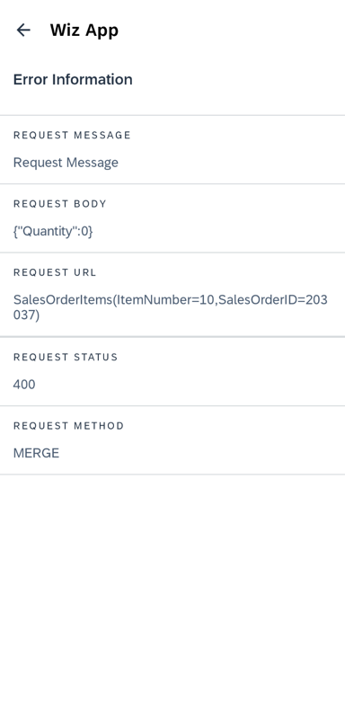

    You can see that the HTTP status code, method, and message are included. When the application attempted a sync, the entity being updated didn't pass the backend checks and produced a `DataServiceException` and is now in the error state. All entities that did not produce errors are successfully synced. One way to correct the exception would be to change the quantity from 0 to a valid positive number. Another would be to delete the `ErrorArchive` entry, reverting the entity to its previous state. For more information on error handling, see [Handling Errors and Conflicts](https://help.sap.com/doc/f53c64b93e5140918d676b927a3cd65b/Cloud/en-US/docs-en/guides/features/offline/common/handling-errors-and-conflicts/handling-errors-and-conflicts.html) and [Handling Failed Requests](https://help.sap.com/doc/f53c64b93e5140918d676b927a3cd65b/Cloud/en-US/docs-en/guides/features/offline/common/handling-failed-requests/handling-failed-requests.html).

[OPTION END]

>Further information on using the offline feature can be found at [Step by Step with the SAP BTP SDK for Android — Part 6 — Offline OData](https://blogs.sap.com/2018/10/15/step-by-step-with-the-sap-cloud-platform-sdk-for-android-part-6-offline-odata/).

Congratulations! You have created an offline-enabled app using the SAP BTP SDK Wizard for Android and examined how the `ErrorArchive` can be used to view synchronization errors!


---
